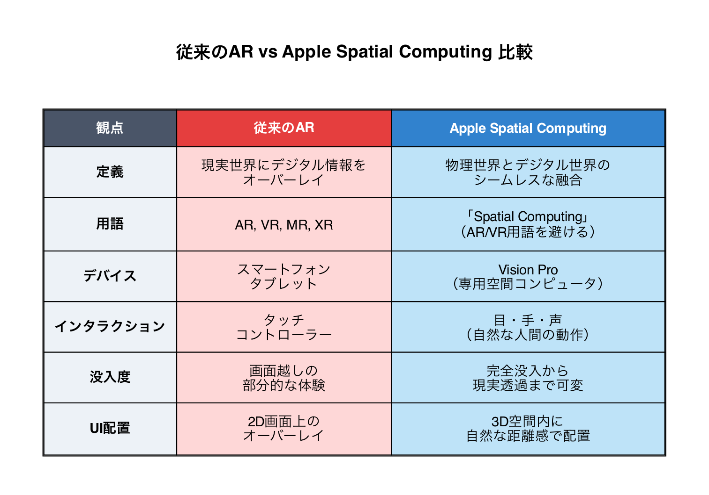
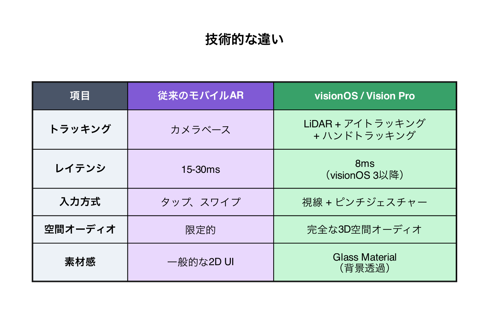
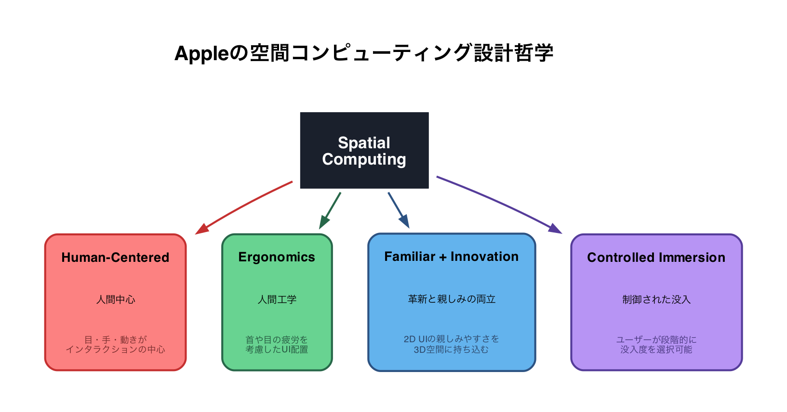
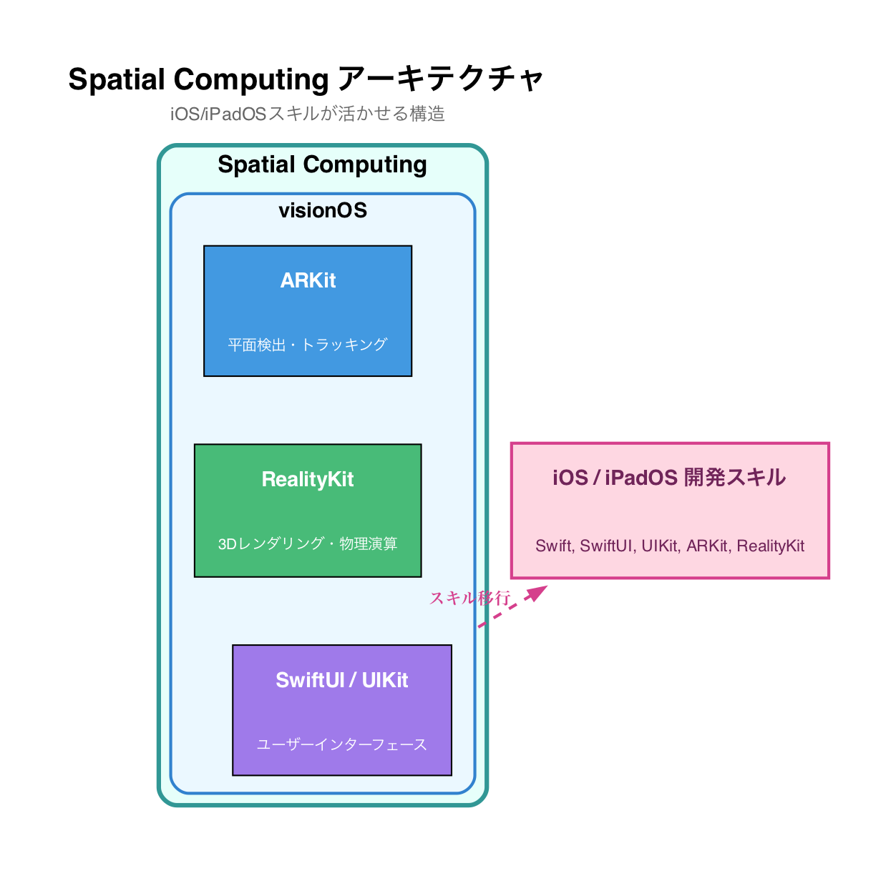
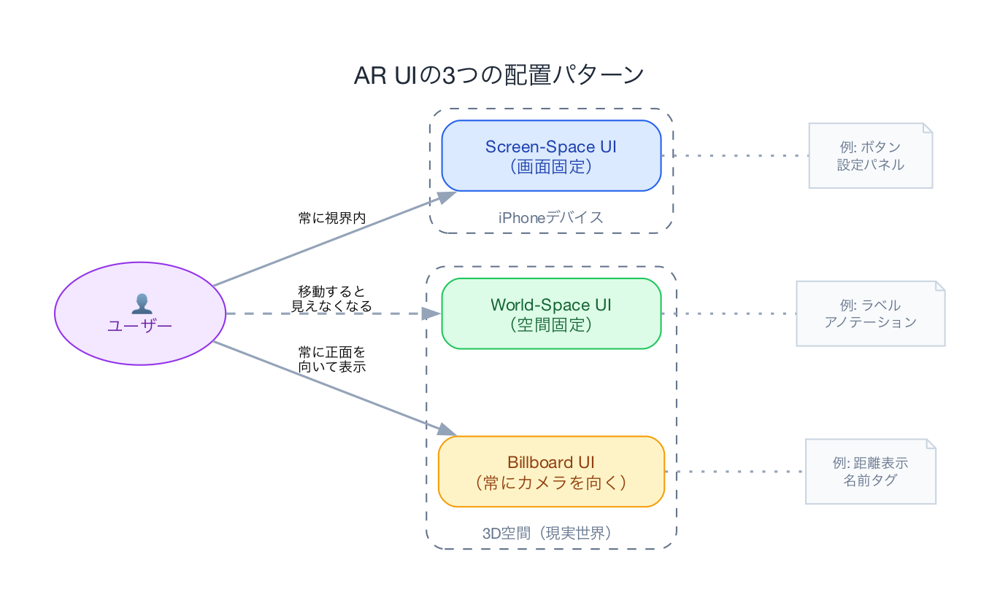
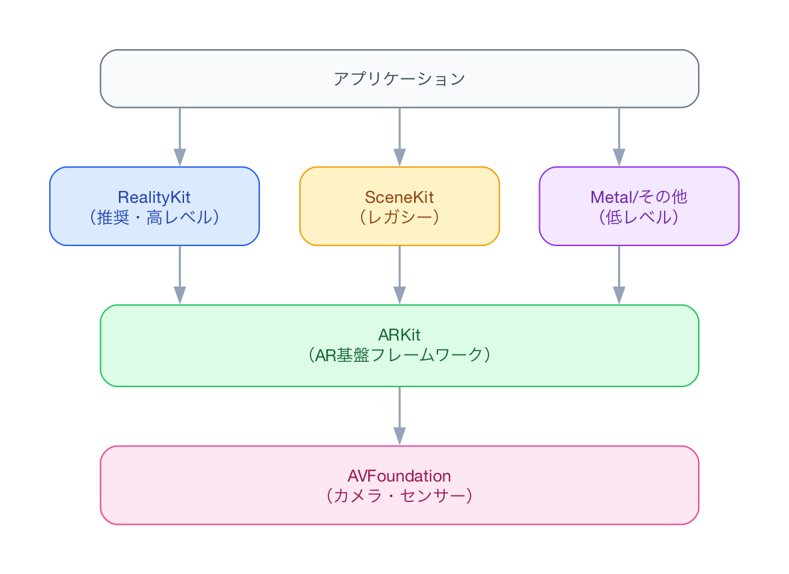
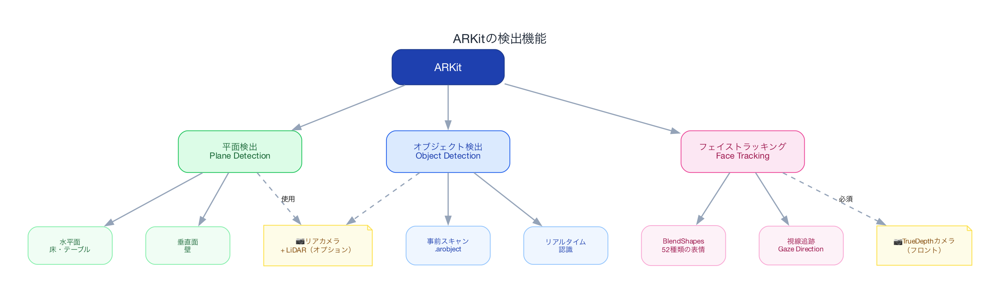
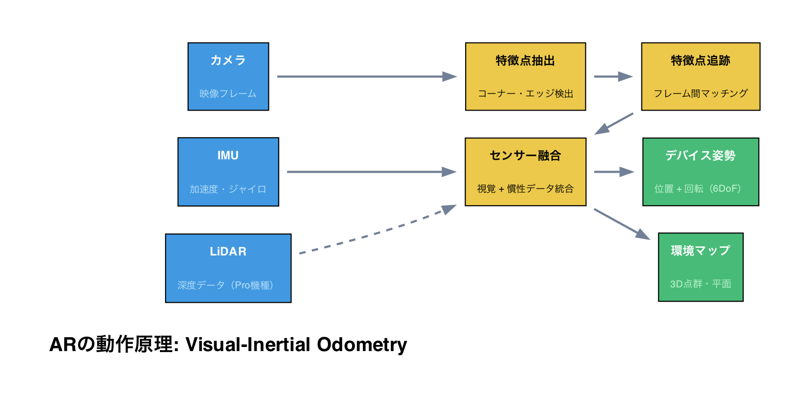
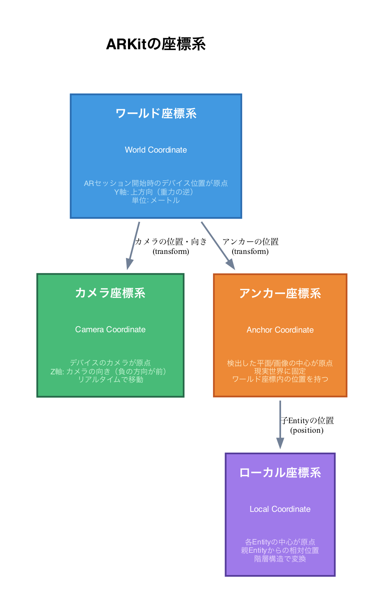
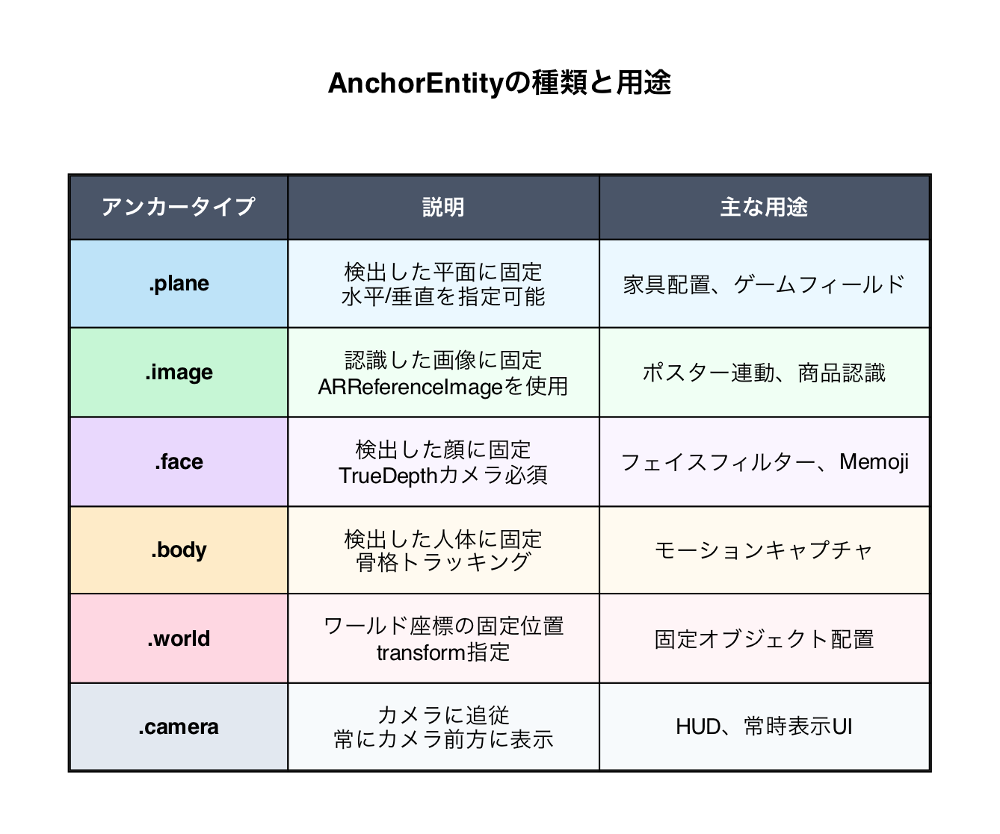

## 目次

1. ARとは何か
2. iOSにおけるAR開発の歴史
3. ARにおけるUIデザイン
4. 利用可能なフレームワーク
5. ARKitの検出機能
6. 本プロジェクトの構成

**付録：開発リファレンス**
- A. ARの動作原理
- B. 座標系
- C. アンカーの種類と使い分け
- D. 光源推定
- E. オクルージョン
- F. パフォーマンス考慮事項
- G. トラブルシューティング

---

## 1. ARとは何か

### AR（Augmented Reality：拡張現実）の定義

ARとは、現実世界の映像にデジタル情報を重ね合わせて表示する技術です。VR（仮想現実）が完全に仮想の世界に没入するのに対し、ARは現実世界を基盤としてその上に情報を追加します。

### ARの主な特徴

| 特徴 | 説明 |
|------|------|
| 現実との融合 | カメラで撮影した現実世界にCGを重ねる |
| リアルタイム性 | ユーザーの動きに合わせて即座に反応 |
| インタラクティブ | 仮想オブジェクトとの相互作用が可能 |

### ARの活用例

- **ゲーム**: Pokémon GO、Minecraft Earth
- **ショッピング**: 家具の配置シミュレーション（IKEA Place）
- **教育**: 3D解剖図、歴史的建造物の復元
- **ナビゲーション**: Google Maps ARナビ
- **計測**: iOSの「計測」アプリ

---

## 2. iOSにおけるAR開発の歴史

### 従来のARの概念

AR（拡張現実）の定義は、一般的に以下の3つの要素で構成されます：

1. **現実世界と仮想世界の融合**
2. **リアルタイムのインタラクション**
3. **仮想オブジェクトの正確な3D位置合わせ**

従来のARは主に「現実世界にデジタル情報をオーバーレイする技術」として捉えられてきました。スマートフォンの画面越しに見る体験が中心で、ユーザーは常にデバイスを手に持ち、画面を通して拡張された現実を見るという形式でした。

### 年表

| 年 | 出来事 |
|----|--------|
| 2017 | **ARKit 1.0** リリース（iOS 11） - 平面検出、照明推定 |
| 2018 | **ARKit 2.0** - 共有体験、画像トラッキング |
| 2019 | **ARKit 3.0** - People Occlusion、モーションキャプチャ |
| 2019 | **RealityKit** 登場 - 高レベルAR開発フレームワーク |
| 2020 | **ARKit 4.0** - LiDARサポート、Location Anchors |
| 2021 | **ARKit 5.0** - 改善された顔トラッキング |
| 2022 | **ARKit 6.0** - 4Kビデオ、HDR対応 |
| 2023 | **visionOS** 発表 - 空間コンピューティング時代へ |
| 2024 | **Vision Pro** 発売 - Appleの空間コンピュータ |
| 2025 | **ARKit 7.0** - 空間マッピング強化、visionOS 26 リリース |

### LiDARスキャナの登場

iPhone 12 Pro以降に搭載されたLiDARスキャナにより、ARの精度が飛躍的に向上しました：

- より正確な深度測定
- 暗所でのAR対応
- 即座のオクルージョン（遮蔽）処理

### 従来のARからSpatial Computing（空間コンピューティング）へ

#### パラダイムシフト

2023年のvisionOS発表と2024年のVision Pro発売により、Appleは従来のAR/VR/MRという用語を使わず、**「Spatial Computing（空間コンピューティング）」** という新しい概念を提唱しています。

Tim Cook CEOは次のように述べています：
> 「Macは私たちをパーソナルコンピューティングの時代に導き、iPhoneはモバイルコンピューティングの時代に導いた。そしてVision Proは私たちを空間コンピューティングの時代へ導くだろう」

#### 従来のAR vs Apple Spatial Computing 比較



#### 技術的な違い



#### Appleの設計哲学



#### iOS開発者への影響

visionOSは既存のiOS/iPadOSアプリとの互換性を重視しており、多くのSwiftUI/UIKitアプリはそのままvisionOSで動作します。また、ARKit/RealityKitのスキルはvisionOS開発に直接活かすことができます。



#### 今後の展望

Appleは2026-2027年頃に、一日中装着できる軽量なARグラス（Apple Glasses）の発表を目指しているとされています。現在のVision Proはその技術基盤を構築するための第一歩であり、iOS開発者がARKit/RealityKitを学ぶことは、将来の空間コンピューティング時代への重要な準備となります。

### 参考資料

- [visionOS Overview - Apple Developer](https://developer.apple.com/visionos/)
- [Apple Vision Pro brings a new era of spatial computing - Apple Newsroom](https://www.apple.com/newsroom/2024/04/apple-vision-pro-brings-a-new-era-of-spatial-computing-to-business/)
- [Difference Between AR/VR and Spatial Computing - Treeview](https://treeview.studio/blog/difference-between-ar-vr-and-spatial-computing)
- [The Design Philosophy Behind Apple Vision Pro - 618media](https://618media.com/en/blog/the-design-philosophy-behind-apple-vision-pro/)

---

## 3. ARにおけるUIデザイン

### 従来のUIとARのUIの違い

ARアプリケーションでは、UIデザインの考え方が根本的に変わります。

| 観点 | 従来の2D UI | AR UI |
|------|-------------|-------|
| キャンバス | 固定サイズの画面 | 無限の3D空間 |
| 視点 | 固定（画面正面） | ユーザーが自由に移動 |
| 入力 | タップ、スワイプ | タップ + 空間ジェスチャー |
| 深度 | なし（Z-indexのみ） | 実際の奥行き |
| 照明 | 静的 | 環境に応じて動的 |

### UIの配置パターン

ARにおけるUIは大きく3つのパターンに分類されます：



#### 1. スクリーンスペースUI（Screen-Space）

画面に固定される従来型のUI。ARビューの上にオーバーレイとして表示されます。

```swift
// SwiftUIでスクリーンスペースUIを重ねる
ZStack {
    RealityView { content in
        // AR コンテンツ
    }

    // スクリーンスペースUI
    VStack {
        Spacer()
        Button("オブジェクトを配置") {
            // アクション
        }
        .padding()
    }
}
```

**用途**: 設定ボタン、情報表示、操作パネル

#### 2. ワールドスペースUI（World-Space）

3D空間内に配置され、現実世界に固定されるUI。

```swift
// 3D空間に配置するラベル
let textEntity = ModelEntity(
    mesh: .generateText("ここに配置",
        extrusionDepth: 0.01,
        font: .systemFont(ofSize: 0.1))
)
textEntity.position = [0, 0.2, 0] // オブジェクトの上に配置
anchor.addChild(textEntity)
```

**用途**: オブジェクトのラベル、空間アノテーション、ナビゲーション矢印

#### 3. ビルボードUI（Billboard）

常にカメラ（ユーザー）の方を向くUI。ワールドスペースに配置されつつ、可読性を維持します。

**用途**: 距離表示、名前タグ、ステータス表示

### 入力方式の設計

| 入力方式 | 説明 | iOSでの実装 |
|----------|------|-------------|
| タップ | 画面タッチでレイキャスト | `UITapGestureRecognizer` |
| ドラッグ | オブジェクトの移動 | `UIPanGestureRecognizer` |
| ピンチ | 拡大縮小 | `UIPinchGestureRecognizer` |
| 回転 | オブジェクトの回転 | `UIRotationGestureRecognizer` |

### ARにおけるUXのベストプラクティス

#### Do（推奨）

- **オンボーディング**: 平面検出中はガイダンスを表示
- **フィードバック**: オブジェクト配置時に視覚・音声で応答
- **適切なサイズ**: 現実世界のスケールに合わせる
- **シンプルな操作**: 片手で操作できるUI設計

#### Don't（非推奨）

- 画面全体を覆うUI（AR体験を阻害）
- 複雑なジェスチャーの要求
- 現実との違和感があるオブジェクト配置
- バッテリー消費を無視した常時処理

### コーチングオーバーレイ

AppleはARKitに**ARCoachingOverlayView**を提供しています。これにより、ユーザーに適切な動作を促すガイダンスを簡単に実装できます。

```swift
// コーチングオーバーレイの追加（UIKit）
let coachingOverlay = ARCoachingOverlayView()
coachingOverlay.goal = .horizontalPlane
coachingOverlay.session = arSession
arView.addSubview(coachingOverlay)
```

表示される内容：
- 「デバイスをゆっくり動かしてください」
- 「平面を検出中...」
- 「より明るい場所に移動してください」

---

## 4. 利用可能なフレームワーク

### フレームワーク比較



### ARKit

AppleのAR基盤フレームワーク。以下の機能を提供：

- **ワールドトラッキング**: デバイスの位置と向きを追跡
- **平面検出**: 水平面・垂直面の認識
- **画像認識**: マーカーベースのAR
- **顔トラッキング**: Face IDカメラを使用
- **ボディトラッキング**: 人体の姿勢推定

### RealityKit

ARKit上に構築された高レベルフレームワーク（**本プロジェクトで使用**）：

```swift
// RealityKitの基本構造
import RealityKit

struct ContentView: View {
    var body: some View {
        RealityView { content in
            // 3Dコンテンツをここに追加
            let anchor = AnchorEntity(.plane(.horizontal, ...))
            content.add(anchor)
        }
    }
}
```

**RealityKitの特徴:**

- SwiftUIとの統合（`RealityView`）
- 物理シミュレーション内蔵
- PBR（物理ベースレンダリング）
- アニメーションシステム
- Reality Composerとの連携

### SceneKit（レガシー）

iOS 8から存在する3Dフレームワーク。ARKitと組み合わせて使用可能ですが、新規プロジェクトではRealityKitを推奨します。

---

## 5. ARKitの検出機能

ARKitは様々な検出機能を提供しています。本章では主要な3つの機能を解説します。



### 5.1 平面検出（Plane Detection）

現実世界の平らな面（床、テーブル、壁など）を検出する機能です。

#### 検出可能な平面タイプ

| タイプ | 説明 | 用途例 |
|--------|------|--------|
| `.horizontal` | 水平面（床、テーブル） | オブジェクト配置 |
| `.vertical` | 垂直面（壁） | ポスター、絵画の表示 |
| `.any` | すべての平面 | 汎用的なAR体験 |

#### 平面の分類（Classification）

ARKit 3.0以降では、検出した平面の種類も識別できます：

| 分類 | 説明 |
|------|------|
| `.floor` | 床 |
| `.table` | テーブル |
| `.seat` | 椅子・ソファ |
| `.wall` | 壁 |
| `.ceiling` | 天井 |
| `.door` | ドア |
| `.window` | 窓 |

#### RealityKitでの実装

```swift
// 水平面（テーブル以上のサイズ）を検出してアンカーを配置
let anchor = AnchorEntity(
    .plane(.horizontal,
           classification: .table,
           minimumBounds: SIMD2<Float>(0.3, 0.3))
)
```

### 5.2 オブジェクト検出（Object Detection）

事前にスキャンした3Dオブジェクトを現実世界で認識する機能です。

#### 仕組み

1. **事前準備**: Reality Composer または専用アプリで対象物をスキャン
2. **ARReferenceObject**: スキャンデータを`.arobject`ファイルとして保存
3. **実行時**: カメラ映像から同じオブジェクトを検出

#### ユースケース

- **博物館**: 展示物を認識して解説を表示
- **製造業**: 部品を認識して組立手順を表示
- **玩具**: フィギュアを認識してゲームと連動

#### 実装例

```swift
// ARKitでのオブジェクト検出設定
let configuration = ARWorldTrackingConfiguration()

// Assets.xcassetsに追加したARリソースグループを読み込み
guard let referenceObjects = ARReferenceObject.referenceObjects(
    inGroupNamed: "DetectionObjects",
    bundle: nil
) else { return }

configuration.detectionObjects = referenceObjects
arSession.run(configuration)
```

#### 制限事項

- 対象物は**静的**である必要がある（変形しない）
- テクスチャが少ない物体は検出困難
- サイズは約**10cm〜数m**が推奨

### 5.3 フェイストラッキング（Face Tracking）

TrueDepthカメラを使用して顔を検出・追跡する機能です。

#### 検出できる情報

| 情報 | 説明 |
|------|------|
| 顔の位置・向き | 3D空間での頭部の位置と回転 |
| 表情（BlendShapes） | 52種類の表情パラメータ |
| 視線方向 | 左右の目の向き |
| 舌の検出 | 舌を出しているかどうか |

#### BlendShapesの例

```swift
// 表情パラメータの取得（ARKit）
func renderer(_ renderer: SCNSceneRenderer, didUpdate node: SCNNode, for anchor: ARAnchor) {
    guard let faceAnchor = anchor as? ARFaceAnchor else { return }

    let blendShapes = faceAnchor.blendShapes

    // 笑顔の度合い（0.0〜1.0）
    let smileLeft = blendShapes[.mouthSmileLeft]?.floatValue ?? 0
    let smileRight = blendShapes[.mouthSmileRight]?.floatValue ?? 0

    // 目の開き具合
    let eyeBlinkLeft = blendShapes[.eyeBlinkLeft]?.floatValue ?? 0
    let eyeBlinkRight = blendShapes[.eyeBlinkRight]?.floatValue ?? 0

    // まゆげの動き
    let browInnerUp = blendShapes[.browInnerUp]?.floatValue ?? 0
}
```

#### 主なBlendShape一覧

| カテゴリ | パラメータ例 |
|----------|-------------|
| 目 | `eyeBlinkLeft`, `eyeBlinkRight`, `eyeWideLeft`, `eyeWideRight` |
| 眉 | `browDownLeft`, `browDownRight`, `browInnerUp`, `browOuterUpLeft` |
| 口 | `mouthSmileLeft`, `mouthSmileRight`, `mouthOpen`, `mouthPucker` |
| 頬 | `cheekPuff`, `cheekSquintLeft`, `cheekSquintRight` |
| 顎 | `jawOpen`, `jawForward`, `jawLeft`, `jawRight` |
| 舌 | `tongueOut` |

#### ユースケース

- **Memoji / アバター**: 表情をキャラクターに反映
- **フィルター**: Snapchat風のフェイスフィルター
- **認証**: 顔認識によるアプリ機能
- **アクセシビリティ**: 表情でデバイス操作

### 開発・テスト環境について

#### シミュレーターでのテスト

| 機能 | シミュレーター | 実機 |
|------|:--------------:|:----:|
| 平面検出 | ❌ | ✅ |
| オブジェクト検出 | ❌ | ✅ |
| フェイストラッキング | ❌ | ✅ |

**重要**: ARKit機能は**iOSシミュレーターではテストできません**。MacBookのカメラを使用することもできません。ARKitは実機のセンサー（加速度計、ジャイロスコープ、LiDAR、TrueDepthカメラなど）に依存しているためです。

#### フェイストラッキングの実機要件

| 要件 | 詳細 |
|------|------|
| デバイス | TrueDepthカメラ搭載機（iPhone X以降、iPad Pro 2018以降） |
| iOS | iOS 11.0以降（機能により異なる） |
| カメラ | **フロントカメラ**を使用（リアカメラでは不可） |

#### 開発時のワークフロー

```
┌─────────────────┐     ┌─────────────────┐
│  Xcodeで開発     │ ──→ │  実機でテスト    │
│  （コード編集）    │     │  （AR機能確認）   │
└─────────────────┘     └─────────────────┘
         │
         ↓
┌─────────────────┐
│ シミュレーター    │
│ （UI/ロジックのみ）│
└─────────────────┘
```

シミュレーターでは、AR以外のUI部分やビジネスロジックのテストに留め、AR機能は必ず実機で確認してください。

---

## 6. 本プロジェクトの構成

### ファイル構成

```
ydevARApp/
├── ydevARApp/
│   ├── AppDelegate.swift    # アプリライフサイクル
│   ├── ContentView.swift    # メインARビュー
│   └── Assets.xcassets      # アセット
├── ydevARApp.xcodeproj      # Xcodeプロジェクト
├── ydevARAppTests/          # ユニットテスト
└── ydevARAppUITests/        # UIテスト
```

### ContentView.swift の解説

```swift
import SwiftUI
import RealityKit

struct ContentView : View {
    var body: some View {
        RealityView { content in
            // 1. 3Dモデル（キューブ）を作成
            let model = Entity()
            let mesh = MeshResource.generateBox(size: 0.1, cornerRadius: 0.005)
            let material = SimpleMaterial(color: .gray, roughness: 0.15, isMetallic: true)
            model.components.set(ModelComponent(mesh: mesh, materials: [material]))
            model.position = [0, 0.05, 0]

            // 2. 水平面アンカーを作成
            let anchor = AnchorEntity(
                .plane(.horizontal, classification: .any, minimumBounds: SIMD2<Float>(0.2, 0.2))
            )
            anchor.addChild(model)

            // 3. シーンに追加
            content.add(anchor)
            content.camera = .spatialTracking
        }
        .edgesIgnoringSafeArea(.all)
    }
}
```

### コードの動作

1. **RealityView**: SwiftUIでRealityKitシーンを表示するビュー
2. **Entity**: RealityKitの基本オブジェクト
3. **MeshResource**: 3D形状（ここでは10cmの角丸キューブ）
4. **SimpleMaterial**: PBRマテリアル（金属的な灰色）
5. **AnchorEntity**: 現実世界の平面に固定するアンカー
6. **spatialTracking**: デバイスの動きに追従するカメラモード

---

## 次のステップ

この後の勉強会では以下を扱う予定です：

- [ ] タップでオブジェクトを配置
- [ ] 複数のオブジェクト管理
- [ ] アニメーションの追加
- [ ] Reality Composer Proの活用

---

## 参考リンク

- [ARKit - Apple Developer](https://developer.apple.com/augmented-reality/arkit/)
- [RealityKit - Apple Developer](https://developer.apple.com/documentation/realitykit/)
- [WWDC Sessions on AR](https://developer.apple.com/videos/ar/)

---

## 付録：開発リファレンス

本セクションでは、AR開発時に必要となる技術的な詳細を解説します。概念理解の後、実装時の参照としてご活用ください。

---

### A. ARの動作原理

ARKitは**Visual-Inertial Odometry（VIO）** という技術を使用して、デバイスの位置と向きをリアルタイムで追跡します。



#### 処理の流れ

1. **特徴点抽出**: カメラ映像からコーナーやエッジなどの特徴的な点を検出
2. **特徴点追跡**: フレーム間で同じ特徴点を追跡し、動きを推定
3. **センサー融合**: カメラ情報とIMU（加速度・ジャイロ）を統合して精度向上
4. **出力**: デバイスの6DoF（位置3軸 + 回転3軸）姿勢と環境マップ

#### LiDARの役割（Pro機種）

| 項目 | カメラのみ | カメラ + LiDAR |
|------|-----------|----------------|
| 深度精度 | 推定値 | 実測値 |
| 暗所性能 | 低下 | 維持 |
| 初期化速度 | 数秒 | 即座 |
| メッシュ精度 | 粗い | 高精細 |

---

### B. 座標系

ARKitでは複数の座標系が使用されます。これらの関係を理解することが正確なオブジェクト配置の鍵です。



#### 座標系の詳細

| 座標系 | 原点 | 特徴 |
|--------|------|------|
| **ワールド座標** | ARセッション開始時のデバイス位置 | Y軸が重力の逆方向、単位はメートル |
| **カメラ座標** | デバイスのカメラ | リアルタイムで移動、Z軸負方向が前 |
| **アンカー座標** | 検出した平面/画像の中心 | 現実世界に固定 |
| **ローカル座標** | 各Entityの中心 | 親からの相対位置 |

#### コード例：座標変換

```swift
// ワールド座標でのアンカー位置を取得
let anchorWorldPosition = anchor.position(relativeTo: nil)

// カメラからの相対位置を計算
if let cameraTransform = arView.session.currentFrame?.camera.transform {
    let cameraPosition = SIMD3<Float>(
        cameraTransform.columns.3.x,
        cameraTransform.columns.3.y,
        cameraTransform.columns.3.z
    )
    let relativePosition = anchorWorldPosition - cameraPosition
}
```

---

### C. アンカーの種類と使い分け

RealityKitの`AnchorEntity`は、仮想オブジェクトを現実世界に固定するための基盤です。



#### 実装例

```swift
// 平面アンカー（最も一般的）
let planeAnchor = AnchorEntity(
    .plane(.horizontal, classification: .table, minimumBounds: [0.2, 0.2])
)

// 画像アンカー（マーカーAR）
let imageAnchor = AnchorEntity(.image(group: "AR Resources", name: "marker"))

// カメラアンカー（HUD表示）
let cameraAnchor = AnchorEntity(.camera)
cameraAnchor.position = [0, 0, -0.5] // カメラの50cm前方
```

---

### D. 光源推定（Lighting Estimation）

ARKitは環境光を推定し、仮想オブジェクトを自然に見せるための情報を提供します。

#### 取得できる情報

| プロパティ | 説明 | 用途 |
|------------|------|------|
| `ambientIntensity` | 環境光の明るさ（ルーメン） | 全体の明るさ調整 |
| `ambientColorTemperature` | 色温度（ケルビン） | 色味の調整 |
| `primaryLightDirection` | 主光源の方向 | 影の方向 |
| `primaryLightIntensity` | 主光源の強さ | 影の濃さ |

#### コード例

```swift
// ARFrameから光源情報を取得
if let lightEstimate = frame.lightEstimate {
    let intensity = lightEstimate.ambientIntensity / 1000.0  // 正規化
    let temperature = lightEstimate.ambientColorTemperature

    // RealityKitでは自動的に適用されるが、カスタマイズも可能
    directionalLight.light.intensity = Float(intensity) * 1000
}
```

> **Note**: RealityKitを使用する場合、基本的な光源推定は自動的に適用されます。

---

### E. オクルージョン（遮蔽処理）

オクルージョンとは、現実世界の物体が仮想オブジェクトを遮る処理です。

#### オクルージョンの種類

| 種類 | 説明 | 必要条件 |
|------|------|----------|
| **People Occlusion** | 人物による遮蔽 | A12チップ以降 |
| **Object Occlusion** | LiDARメッシュによる遮蔽 | LiDAR搭載機種 |

#### 実装例

```swift
// ARViewでオクルージョンを有効化
arView.environment.sceneUnderstanding.options.insert(.occlusion)

// People Occlusionの設定（ARKit）
let config = ARWorldTrackingConfiguration()
config.frameSemantics.insert(.personSegmentationWithDepth)
```

#### 注意点

- People Occlusionはバッテリー消費が増加
- LiDARオクルージョンは精度が高いが対応機種限定
- 両方を組み合わせることで最も自然な表現が可能

---

### F. パフォーマンス考慮事項

AR開発では、リアルタイム処理とバッテリー消費のバランスが重要です。

#### チェックリスト

| 項目 | 推奨 | 備考 |
|------|------|------|
| フレームレート | 60fps維持 | 30fps以下で酔い発生 |
| ポリゴン数 | 10万以下/シーン | モバイル向け目安 |
| テクスチャサイズ | 2048x2048以下 | メモリ消費に注意 |
| 物理演算 | 必要最小限 | 衝突判定を単純化 |
| セッション設定 | 必要な機能のみ有効化 | バッテリー節約 |

#### パフォーマンス計測

```swift
// Xcodeのデバッグ機能を活用
arView.debugOptions = [
    .showStatistics,      // FPS、描画コール数
    .showFeaturePoints,   // 特徴点（デバッグ用）
]

// Metal System Trace（Instruments）で詳細分析
```

#### バッテリー消費を抑えるTips

1. **不要な機能を無効化**: People Occlusion、フェイストラッキングなど
2. **フレームレート制限**: 常時60fpsが不要な場面では制限
3. **バックグラウンド時の停止**: ARセッションを適切にpause/resume
4. **軽量なマテリアル使用**: `UnlitMaterial`は`SimpleMaterial`より軽量

```swift
// セッションの一時停止（バックグラウンド移行時）
func applicationWillResignActive(_ application: UIApplication) {
    arView.session.pause()
}

func applicationDidBecomeActive(_ application: UIApplication) {
    arView.session.run(configuration)
}
```

---

### G. トラブルシューティング

#### よくある問題と対処

| 症状 | 原因 | 対処 |
|------|------|------|
| トラッキングが不安定 | 特徴点不足 | テクスチャのある環境で使用 |
| オブジェクトが浮く | 平面検出精度 | minimumBoundsを調整 |
| 初期化が遅い | 暗所・単調な壁 | 照明確保、床を映す |
| メモリ警告 | テクスチャ過多 | アセット最適化 |
| 発熱 | 処理負荷過大 | 機能削減、LOD導入 |

---

*ydev勉強会 - 2025年1月*
