# ARKit & RealityKit & SceneKit SDK機能一覧（2025年版）

本ドキュメントでは、最新のARKit・RealityKit・SceneKitで実装可能な機能を実装観点で整理します。

---

## 目次

1. [トラッキング・検出機能](#1-トラッキング検出機能)
2. [シーン理解・深度](#2-シーン理解深度)
3. [SceneKit（SCN）](#3-scenekitscn)
4. [RealityKit コンポーネント](#4-realitykit-コンポーネント)
5. [マテリアル・シェーダー](#5-マテリアルシェーダー)
6. [アニメーション・パーティクル](#6-アニメーションパーティクル)
7. [特殊機能 (RealityKit 4 / WWDC25)](#7-特殊機能-realitykit-4--wwdc25)
8. [デバイス別機能マトリクス](#8-デバイス別機能マトリクス)
9. [実装パターン例](#9-実装パターン例)
10. [フレームワーク機能別アプリ事例](#10-フレームワーク機能別アプリ事例)
11. [参考リンク](#11-参考リンク)

---

## 1. トラッキング・検出機能

### 平面検出

| 機能 | 実装クラス/API | 対応デバイス | 備考 |
|------|---------------|-------------|------|
| 水平面検出 | `AnchorEntity(.plane(.horizontal))` | 全デバイス | テーブル、床など |
| 垂直面検出 | `AnchorEntity(.plane(.vertical))` | 全デバイス | 壁など |
| 平面分類 | `.classification: .floor/.wall/.ceiling/.table` | LiDAR搭載機 | より詳細な分類が可能 |

```swift
// 基本的な水平面検出
let anchor = AnchorEntity(.plane(.horizontal,
                                  classification: .any,
                                  minimumBounds: SIMD2<Float>(0.2, 0.2)))

// テーブルのみを検出
let tableAnchor = AnchorEntity(.plane(.horizontal,
                                       classification: .table,
                                       minimumBounds: SIMD2<Float>(0.3, 0.3)))
```

### 画像トラッキング

| 機能 | 実装API | 対応デバイス | 備考 |
|------|---------|-------------|------|
| 参照画像検出 | `ARImageTrackingConfiguration` | 全デバイス | 最大100枚同時検出 |
| 画像サイズ自動推定 | `ARReferenceImage` | 全デバイス | 物理サイズ推定可能 |
| ワールド内画像検出 | `ARWorldTrackingConfiguration` + `detectionImages` | 全デバイス | ワールドトラッキングと併用 |

```swift
// 参照画像の設定
guard let referenceImages = ARReferenceImage.referenceImages(
    inGroupNamed: "AR Resources",
    bundle: nil
) else { return }

let configuration = ARWorldTrackingConfiguration()
configuration.detectionImages = referenceImages
configuration.maximumNumberOfTrackedImages = 4
```

### オブジェクト検出

| 機能 | 実装API | 対応デバイス | 備考 |
|------|---------|-------------|------|
| 3Dオブジェクト認識 | `ARObjectScanningConfiguration` | 全デバイス | 事前スキャン必要 |
| リアルタイム追跡 | `ObjectTrackingProvider` | Vision Pro | WWDC24で追加、動的追跡 |

### 顔トラッキング

| 機能 | 実装API | 対応デバイス | 備考 |
|------|---------|-------------|------|
| 表情検出 | `ARFaceTrackingConfiguration` | TrueDepth搭載機 | 最大3人同時追跡 |
| 52ブレンドシェイプ | `ARFaceAnchor.blendShapes` | TrueDepth搭載機 | 詳細な表情データ |
| フロント+バック同時 | 同時使用可能 | A12+チップ | iOS 13以降 |

```swift
// 顔トラッキングの設定
let configuration = ARFaceTrackingConfiguration()
configuration.isWorldTrackingEnabled = true  // ワールドトラッキングと併用
configuration.maximumNumberOfTrackedFaces = 3

// ブレンドシェイプの取得
if let faceAnchor = anchor as? ARFaceAnchor {
    let smile = faceAnchor.blendShapes[.mouthSmileLeft]
    let eyeBlink = faceAnchor.blendShapes[.eyeBlinkLeft]
}
```

### ボディトラッキング

| 機能 | 実装API | 対応デバイス | 備考 |
|------|---------|-------------|------|
| 全身モーションキャプチャ | `ARBodyTrackingConfiguration` | A12+チップ | 91ジョイント |
| 2Dポーズ検出 | `ARBody2D` | 全デバイス | 軽量版、画面座標 |
| 手・足トラッキング | Motion Capture API | A12+/LiDAR | 部分的な体も検出可能 |
| 耳のトラッキング | Motion Capture API | A12+ | 左右の耳を追跡 |

```swift
// ボディトラッキングの設定
let configuration = ARBodyTrackingConfiguration()
configuration.automaticSkeletonScaleEstimationEnabled = true

// ジョイント位置の取得
if let bodyAnchor = anchor as? ARBodyAnchor {
    let skeleton = bodyAnchor.skeleton
    let hipTransform = skeleton.modelTransform(for: .root)
    let leftHandTransform = skeleton.modelTransform(for: .leftHand)
}
```

### ハンドトラッキング（visionOS専用）

| 機能 | 実装API | 対応デバイス | 備考 |
|------|---------|-------------|------|
| 手のジェスチャー | `HandTrackingProvider` | Vision Pro | iOSでは非対応 |
| 指の関節追跡 | `HandAnchor` | Vision Pro | 各指の詳細な追跡 |

### ルームトラッキング（visionOS専用）

| 機能 | 実装API | 対応デバイス | 備考 |
|------|---------|-------------|------|
| 部屋境界検出 | `RoomTrackingProvider` | Vision Pro | WWDC24で追加 |
| 壁・床のジオメトリ | `RoomAnchor` | Vision Pro | 精密なアライメント |

### 永続化・共有（ARWorldMap / Collaborative Session）

AR体験の保存・復元、および複数デバイス間での共有機能。

| 機能 | 実装API | 用途 | 備考 |
|------|---------|------|------|
| **ARWorldMap** | `ARSession.getCurrentWorldMap()` | AR空間の保存・復元 | 同じ場所での再開 |
| **Collaborative Session** | `ARSession.collaborationData` | 複数デバイスでAR共有 | リアルタイム同期 |
| **MultipeerConnectivity** | `MCSession` | P2Pネットワーク通信 | WorldMap/アンカー送受信 |
| **SharePlay** | `GroupActivity` | FaceTime中のAR共有 | visionOS/iOS対応 |

#### ARWorldMap（空間の永続化）

ARWorldMapは、ARKitがトラッキングしている空間情報をシリアライズして保存・復元する機能。

```swift
// WorldMapの取得と保存
func saveWorldMap() {
    arSession.getCurrentWorldMap { worldMap, error in
        guard let worldMap = worldMap else { return }

        do {
            let data = try NSKeyedArchiver.archivedData(
                withRootObject: worldMap,
                requiringSecureCoding: true
            )
            // ファイルに保存
            try data.write(to: worldMapURL)
        } catch {
            print("Failed to save world map: \(error)")
        }
    }
}

// WorldMapの復元
func loadWorldMap() {
    guard let data = try? Data(contentsOf: worldMapURL),
          let worldMap = try? NSKeyedUnarchiver.unarchivedObject(
              ofClass: ARWorldMap.self,
              from: data
          ) else { return }

    let configuration = ARWorldTrackingConfiguration()
    configuration.initialWorldMap = worldMap
    arSession.run(configuration, options: [.resetTracking, .removeExistingAnchors])
}
```

| ユースケース | 説明 |
|------------|------|
| 作業の中断・再開 | ARで配置したオブジェクトを次回起動時に復元 |
| 場所ベースのAR | 特定の場所に固定されたAR体験 |
| ARコンテンツの共有 | 同じ場所を訪れた他のユーザーに同じAR体験を提供 |

#### Collaborative Session（リアルタイム共有）

iOS 13以降、複数デバイスでARセッションをリアルタイムに共有可能。

```swift
// Collaborative Sessionの設定
let configuration = ARWorldTrackingConfiguration()
configuration.isCollaborationEnabled = true

arSession.run(configuration)

// コラボレーションデータの送信（MultipeerConnectivityと連携）
func session(_ session: ARSession, didOutputCollaborationData data: ARSession.CollaborationData) {
    // 他のデバイスに送信
    guard let encodedData = try? NSKeyedArchiver.archivedData(
        withRootObject: data,
        requiringSecureCoding: true
    ) else { return }

    sendToAllPeers(encodedData)
}

// コラボレーションデータの受信
func receiveCollaborationData(_ data: Data) {
    guard let collaborationData = try? NSKeyedUnarchiver.unarchivedObject(
        ofClass: ARSession.CollaborationData.self,
        from: data
    ) else { return }

    arSession.update(with: collaborationData)
}
```

#### MultipeerConnectivity（P2P通信）

近距離のデバイス間でWorldMapやアンカー情報を送受信。

```swift
import MultipeerConnectivity

class ARMultipeerSession: NSObject {
    private let serviceType = "ar-collab"
    private let myPeerID = MCPeerID(displayName: UIDevice.current.name)
    private var session: MCSession!
    private var advertiser: MCNearbyServiceAdvertiser!
    private var browser: MCNearbyServiceBrowser!

    override init() {
        super.init()
        session = MCSession(peer: myPeerID, securityIdentity: nil, encryptionPreference: .required)
        session.delegate = self

        // 広告（他のデバイスに自分を公開）
        advertiser = MCNearbyServiceAdvertiser(peer: myPeerID, discoveryInfo: nil, serviceType: serviceType)
        advertiser.delegate = self
        advertiser.startAdvertisingPeer()

        // 検索（他のデバイスを探す）
        browser = MCNearbyServiceBrowser(peer: myPeerID, serviceType: serviceType)
        browser.delegate = self
        browser.startBrowsingForPeers()
    }

    // WorldMapの送信
    func sendWorldMap(_ worldMap: ARWorldMap) {
        guard let data = try? NSKeyedArchiver.archivedData(
            withRootObject: worldMap,
            requiringSecureCoding: true
        ) else { return }

        try? session.send(data, toPeers: session.connectedPeers, with: .reliable)
    }

    // アンカーの送信
    func sendAnchor(_ anchor: ARAnchor) {
        guard let data = try? NSKeyedArchiver.archivedData(
            withRootObject: anchor,
            requiringSecureCoding: true
        ) else { return }

        try? session.send(data, toPeers: session.connectedPeers, with: .reliable)
    }
}

extension ARMultipeerSession: MCSessionDelegate {
    func session(_ session: MCSession, didReceive data: Data, fromPeer peerID: MCPeerID) {
        // WorldMapまたはアンカーを受信
        if let worldMap = try? NSKeyedUnarchiver.unarchivedObject(ofClass: ARWorldMap.self, from: data) {
            // WorldMapを適用
            DispatchQueue.main.async {
                let configuration = ARWorldTrackingConfiguration()
                configuration.initialWorldMap = worldMap
                self.arSession?.run(configuration, options: [.resetTracking])
            }
        } else if let anchor = try? NSKeyedUnarchiver.unarchivedObject(ofClass: ARAnchor.self, from: data) {
            // アンカーを追加
            arSession?.add(anchor: anchor)
        }
    }

    // 他の必須デリゲートメソッド...
}
```

#### RealityKit での同期（SynchronizationComponent）

RealityKitでは`SynchronizationComponent`でエンティティの自動同期が可能。

```swift
import RealityKit
import MultipeerConnectivity

// 同期可能なエンティティの作成
let entity = ModelEntity(mesh: .generateBox(size: 0.1))
entity.synchronization = SynchronizationComponent()
entity.synchronization?.ownershipTransferMode = .autoAccept

// MultipeerConnectivityServiceの設定
let multipeerService = try! MultipeerConnectivityService(session: mcSession)
arView.scene.synchronizationService = multipeerService
```

| 同期項目 | 自動同期 | 備考 |
|---------|:-------:|------|
| Transform（位置/回転/スケール） | ○ | 自動的に全デバイスで同期 |
| アニメーション再生 | ○ | 再生状態を同期 |
| 物理シミュレーション | △ | オーナーデバイスが計算 |
| カスタムコンポーネント | × | 手動で送受信が必要 |

#### マルチユーザーARの構成パターン

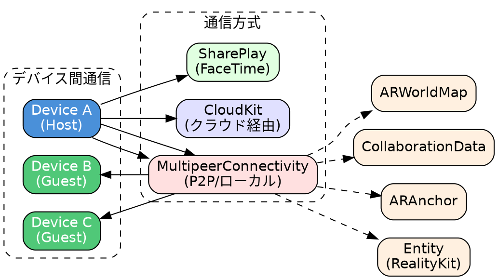

| 方式 | 範囲 | レイテンシ | ユースケース |
|------|------|-----------|------------|
| **MultipeerConnectivity** | ローカル（WiFi/Bluetooth） | 低 | 同室でのマルチプレイヤーゲーム |
| **CloudKit** | グローバル | 中〜高 | 場所に固定されたAR体験の共有 |
| **SharePlay** | FaceTime参加者 | 低〜中 | リモートでの協調作業 |
| **カスタムサーバー** | グローバル | 設計による | 大規模マルチプレイヤー |

---

## 2. シーン理解・深度

| 機能 | 実装API | 対応デバイス | 用途 |
|------|---------|-------------|------|
| **Scene Geometry** | `ARMeshAnchor` | LiDAR搭載機 | 環境の3Dメッシュ生成 |
| **Depth API** | `ARFrame.sceneDepth` | LiDAR搭載機 | ピクセル単位の深度情報 |
| **People Occlusion** | `ARConfiguration.frameSemantics` | A12+チップ | 人物による遮蔽処理 |
| **Object Occlusion** | `EnvironmentBlendingComponent` | LiDAR/Vision Pro | 現実物体による遮蔽 (WWDC25) |
| **Instant AR** | 自動（LiDAR） | LiDAR搭載機 | スキャン不要で即座にAR開始 |
| **環境テクスチャリング** | `.environmentTexturing: .automatic` | 全デバイス | 環境マップ自動生成 |
| **Raycast** | `ARSession.raycast()` | 全デバイス | 画面タップ位置から3D座標取得 |

### Scene Geometry（3Dメッシュ）

```swift
let configuration = ARWorldTrackingConfiguration()
configuration.sceneReconstruction = .mesh  // または .meshWithClassification

// メッシュアンカーの処理
func session(_ session: ARSession, didAdd anchors: [ARAnchor]) {
    for anchor in anchors {
        if let meshAnchor = anchor as? ARMeshAnchor {
            let geometry = meshAnchor.geometry
            // vertices, faces, normals などにアクセス可能
        }
    }
}
```

### Depth API

```swift
configuration.frameSemantics.insert(.sceneDepth)

// 深度データの取得
if let depthMap = frame.sceneDepth?.depthMap {
    // CVPixelBuffer形式の深度マップ
}

if let confidenceMap = frame.sceneDepth?.confidenceMap {
    // 深度の信頼度マップ
}
```

### People Occlusion

```swift
// 人物オクルージョンの有効化
configuration.frameSemantics.insert(.personSegmentationWithDepth)

// セグメンテーションマスクの取得
if let segmentationBuffer = frame.segmentationBuffer {
    // 人物領域のマスク
}
```

---

## 3. SceneKit（SCN）

SceneKitはAppleの3Dグラフィックスフレームワークで、ARKitと組み合わせてAR体験を構築できます。RealityKitより前から存在し、より細かい制御が可能です。

### SceneKit vs RealityKit 比較

| 観点 | SceneKit | RealityKit |
|------|----------|------------|
| **登場時期** | iOS 8 (2014) | iOS 13 (2019) |
| **ARとの統合** | `ARSCNView` | `ARView` / `RealityView` |
| **アーキテクチャ** | シーングラフ（階層構造） | Entity-Component-System |
| **レンダリング** | 独自レンダラー / Metal | Metal最適化 |
| **物理エンジン** | 内蔵（独自） | 内蔵（RealityKitネイティブ） |
| **visionOS対応** | × | ○ |
| **SwiftUI統合** | △（UIViewRepresentable経由） | ○（RealityView） |
| **学習曲線** | 緩やか | やや急 |
| **ドキュメント/サンプル** | 豊富 | 増加中 |

### フレームワーク選択の指針

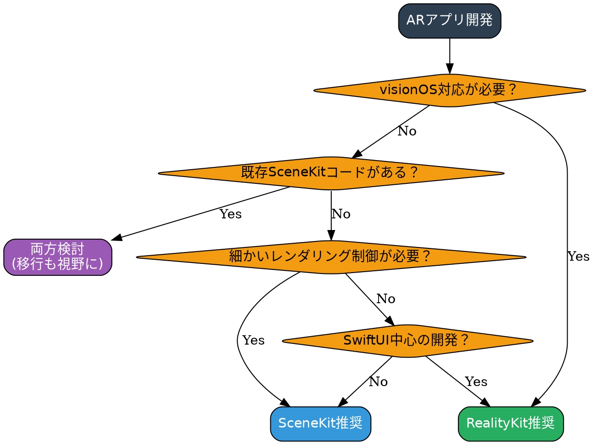

### SceneKitの主要クラス

| クラス | 用途 | RealityKit対応 |
|-------|------|---------------|
| `SCNScene` | シーン全体の管理 | `Scene` |
| `SCNNode` | 3Dオブジェクトのコンテナ | `Entity` |
| `SCNGeometry` | 3Dジオメトリ（メッシュ） | `MeshResource` |
| `SCNMaterial` | マテリアル設定 | `Material` |
| `SCNLight` | ライト | `PointLight`, `DirectionalLight` |
| `SCNCamera` | カメラ | `PerspectiveCamera` |
| `SCNAction` | アニメーション | `FromToByAnimation` |
| `SCNPhysicsBody` | 物理ボディ | `PhysicsBodyComponent` |
| `SCNParticleSystem` | パーティクル | `ParticleEmitterComponent` |

### ARSCNView を使ったAR実装

```swift
import ARKit
import SceneKit

class ARViewController: UIViewController, ARSCNViewDelegate {
    var sceneView: ARSCNView!

    override func viewDidLoad() {
        super.viewDidLoad()

        sceneView = ARSCNView(frame: view.bounds)
        sceneView.delegate = self
        sceneView.autoenablesDefaultLighting = true
        sceneView.automaticallyUpdatesLighting = true
        view.addSubview(sceneView)

        // デバッグオプション
        sceneView.debugOptions = [.showFeaturePoints, .showWorldOrigin]
    }

    override func viewWillAppear(_ animated: Bool) {
        super.viewWillAppear(animated)

        let configuration = ARWorldTrackingConfiguration()
        configuration.planeDetection = [.horizontal, .vertical]
        configuration.environmentTexturing = .automatic

        sceneView.session.run(configuration)
    }

    override func viewWillDisappear(_ animated: Bool) {
        super.viewWillDisappear(animated)
        sceneView.session.pause()
    }

    // 平面検出時のコールバック
    func renderer(_ renderer: SCNSceneRenderer, didAdd node: SCNNode, for anchor: ARAnchor) {
        guard let planeAnchor = anchor as? ARPlaneAnchor else { return }

        // 検出された平面を可視化
        let plane = SCNPlane(width: CGFloat(planeAnchor.extent.x),
                             height: CGFloat(planeAnchor.extent.z))
        plane.firstMaterial?.diffuse.contents = UIColor.blue.withAlphaComponent(0.3)

        let planeNode = SCNNode(geometry: plane)
        planeNode.position = SCNVector3(planeAnchor.center.x, 0, planeAnchor.center.z)
        planeNode.eulerAngles.x = -.pi / 2

        node.addChildNode(planeNode)
    }

    // 平面更新時のコールバック
    func renderer(_ renderer: SCNSceneRenderer, didUpdate node: SCNNode, for anchor: ARAnchor) {
        guard let planeAnchor = anchor as? ARPlaneAnchor,
              let planeNode = node.childNodes.first,
              let plane = planeNode.geometry as? SCNPlane else { return }

        plane.width = CGFloat(planeAnchor.extent.x)
        plane.height = CGFloat(planeAnchor.extent.z)
        planeNode.position = SCNVector3(planeAnchor.center.x, 0, planeAnchor.center.z)
    }
}
```

### SCNNode と SCNGeometry

```swift
// 基本的な3Dオブジェクトの作成
func createBox() -> SCNNode {
    // ジオメトリの作成
    let box = SCNBox(width: 0.1, height: 0.1, length: 0.1, chamferRadius: 0.005)

    // マテリアルの設定
    let material = SCNMaterial()
    material.diffuse.contents = UIColor.blue
    material.metalness.contents = 0.8
    material.roughness.contents = 0.2
    box.materials = [material]

    // ノードの作成
    let node = SCNNode(geometry: box)
    node.position = SCNVector3(0, 0.05, -0.3)

    return node
}

// 複雑なジオメトリ
func createCustomGeometry() -> SCNNode {
    // 頂点データ
    let vertices: [SCNVector3] = [
        SCNVector3(0, 0.1, 0),    // 頂点
        SCNVector3(-0.1, 0, 0.1), // 底面
        SCNVector3(0.1, 0, 0.1),
        SCNVector3(0.1, 0, -0.1),
        SCNVector3(-0.1, 0, -0.1)
    ]

    // インデックス
    let indices: [Int32] = [
        0, 1, 2,  // 三角形1
        0, 2, 3,  // 三角形2
        0, 3, 4,  // 三角形3
        0, 4, 1   // 三角形4
    ]

    let vertexSource = SCNGeometrySource(vertices: vertices)
    let element = SCNGeometryElement(indices: indices, primitiveType: .triangles)

    let geometry = SCNGeometry(sources: [vertexSource], elements: [element])
    return SCNNode(geometry: geometry)
}
```

### SCNAction（アニメーション）

```swift
// 基本的なアクション
let moveUp = SCNAction.moveBy(x: 0, y: 0.5, z: 0, duration: 1.0)
let moveDown = SCNAction.moveBy(x: 0, y: -0.5, z: 0, duration: 1.0)
let sequence = SCNAction.sequence([moveUp, moveDown])
let repeatForever = SCNAction.repeatForever(sequence)

node.runAction(repeatForever)

// 回転アニメーション
let rotate = SCNAction.rotateBy(x: 0, y: .pi * 2, z: 0, duration: 2.0)
node.runAction(SCNAction.repeatForever(rotate))

// フェードイン/アウト
let fadeOut = SCNAction.fadeOut(duration: 0.5)
let fadeIn = SCNAction.fadeIn(duration: 0.5)

// スケールアニメーション
let scaleUp = SCNAction.scale(to: 1.5, duration: 0.3)
let scaleDown = SCNAction.scale(to: 1.0, duration: 0.3)

// カスタムアクション
let customAction = SCNAction.customAction(duration: 1.0) { node, elapsedTime in
    let progress = elapsedTime / 1.0
    node.opacity = CGFloat(1.0 - progress)
}

// グループ（並列実行）
let group = SCNAction.group([rotate, moveUp])

// タイミング関数
moveUp.timingMode = .easeInEaseOut
```

### SCNPhysicsBody（物理演算）

```swift
// 動的な物理ボディ（重力の影響を受ける）
let dynamicBody = SCNPhysicsBody(type: .dynamic, shape: nil)
dynamicBody.mass = 1.0
dynamicBody.friction = 0.5
dynamicBody.restitution = 0.8  // 反発係数
node.physicsBody = dynamicBody

// 静的な物理ボディ（床や壁）
let staticBody = SCNPhysicsBody(type: .static, shape: nil)
floorNode.physicsBody = staticBody

// キネマティック（アニメーションで動くが、他のオブジェクトに影響を与える）
let kinematicBody = SCNPhysicsBody(type: .kinematic, shape: nil)
movingPlatform.physicsBody = kinematicBody

// カスタム形状
let shape = SCNPhysicsShape(geometry: SCNBox(width: 0.1, height: 0.1, length: 0.1, chamferRadius: 0), options: nil)
node.physicsBody = SCNPhysicsBody(type: .dynamic, shape: shape)

// 力を加える
node.physicsBody?.applyForce(SCNVector3(0, 10, 0), asImpulse: true)

// 衝突検出
node.physicsBody?.categoryBitMask = 1
node.physicsBody?.contactTestBitMask = 2
node.physicsBody?.collisionBitMask = 2
```

### SceneKitの衝突検出

```swift
class ARViewController: UIViewController, ARSCNViewDelegate, SCNPhysicsContactDelegate {

    override func viewDidLoad() {
        super.viewDidLoad()
        sceneView.scene.physicsWorld.contactDelegate = self
    }

    // 衝突検出のコールバック
    func physicsWorld(_ world: SCNPhysicsWorld, didBegin contact: SCNPhysicsContact) {
        let nodeA = contact.nodeA
        let nodeB = contact.nodeB

        print("Collision between \(nodeA.name ?? "unknown") and \(nodeB.name ?? "unknown")")

        // 衝突位置
        let contactPoint = contact.contactPoint

        // 衝突の強さ
        let impulse = contact.collisionImpulse
    }

    func physicsWorld(_ world: SCNPhysicsWorld, didEnd contact: SCNPhysicsContact) {
        // 衝突終了時の処理
    }
}
```

### SCNParticleSystem（パーティクル）

```swift
// コードでパーティクルを作成
let particleSystem = SCNParticleSystem()
particleSystem.birthRate = 100
particleSystem.particleLifeSpan = 2.0
particleSystem.particleSize = 0.01
particleSystem.particleColor = .orange
particleSystem.emitterShape = .sphere
particleSystem.spreadingAngle = 180
particleSystem.particleVelocity = 0.5
particleSystem.particleVelocityVariation = 0.2

// 色の変化
particleSystem.particleColorVariation = SCNVector4(0.1, 0.1, 0.1, 0)

// パーティクルをノードに追加
let particleNode = SCNNode()
particleNode.addParticleSystem(particleSystem)
sceneView.scene.rootNode.addChildNode(particleNode)

// .scnpファイルからロード
if let fireParticle = SCNParticleSystem(named: "Fire.scnp", inDirectory: nil) {
    node.addParticleSystem(fireParticle)
}
```

### SceneKitでのモデル読み込み

```swift
// .scn ファイルの読み込み
if let scene = SCNScene(named: "art.scnassets/model.scn") {
    if let modelNode = scene.rootNode.childNode(withName: "ModelName", recursively: true) {
        sceneView.scene.rootNode.addChildNode(modelNode)
    }
}

// .usdz ファイルの読み込み
let url = Bundle.main.url(forResource: "model", withExtension: "usdz")!
let scene = try! SCNScene(url: url, options: nil)
let modelNode = scene.rootNode.childNodes.first!
sceneView.scene.rootNode.addChildNode(modelNode)

// .dae (Collada) ファイルの読み込み
if let scene = SCNScene(named: "art.scnassets/model.dae") {
    // アニメーション付きモデルの処理
    scene.rootNode.enumerateChildNodes { node, _ in
        if let animationKeys = node.animationKeys as? [String] {
            for key in animationKeys {
                if let animation = node.animation(forKey: key) {
                    animation.repeatCount = .infinity
                    node.addAnimation(animation, forKey: key)
                }
            }
        }
    }
}
```

### ヒットテスト（タップ検出）

```swift
@objc func handleTap(_ gesture: UITapGestureRecognizer) {
    let location = gesture.location(in: sceneView)

    // SceneKitのヒットテスト（3Dオブジェクト）
    let hitResults = sceneView.hitTest(location, options: [
        .searchMode: SCNHitTestSearchMode.all.rawValue,
        .ignoreHiddenNodes: true
    ])

    if let result = hitResults.first {
        let node = result.node
        let worldPosition = result.worldCoordinates
        print("Tapped node: \(node.name ?? "unknown") at \(worldPosition)")
    }

    // ARKitのヒットテスト（現実世界の平面）
    if let query = sceneView.raycastQuery(from: location,
                                          allowing: .estimatedPlane,
                                          alignment: .any) {
        let results = sceneView.session.raycast(query)
        if let result = results.first {
            // タップした位置にオブジェクトを配置
            let anchor = ARAnchor(transform: result.worldTransform)
            sceneView.session.add(anchor: anchor)
        }
    }
}
```

### SceneKit用のマテリアル設定

| プロパティ | 説明 | 値の例 |
|-----------|------|--------|
| `diffuse` | 基本色/テクスチャ | UIColor, UIImage |
| `specular` | 反射光の色 | UIColor.white |
| `emission` | 自己発光 | UIColor.orange |
| `normal` | 法線マップ | UIImage |
| `metalness` | 金属感 | 0.0〜1.0 |
| `roughness` | 粗さ | 0.0〜1.0 |
| `ambientOcclusion` | 環境遮蔽 | UIImage |
| `displacement` | ディスプレイスメント | UIImage |

```swift
let material = SCNMaterial()

// PBR（Physically Based Rendering）設定
material.lightingModel = .physicallyBased
material.diffuse.contents = UIImage(named: "albedo.png")
material.metalness.contents = UIImage(named: "metalness.png")
material.roughness.contents = UIImage(named: "roughness.png")
material.normal.contents = UIImage(named: "normal.png")
material.ambientOcclusion.contents = UIImage(named: "ao.png")

// 両面レンダリング
material.isDoubleSided = true

// 透明度
material.transparency = 0.5
material.transparencyMode = .dualLayer
```

---

## 4. RealityKit コンポーネント

### 基本コンポーネント

| コンポーネント | 用途 | 備考 |
|--------------|------|------|
| `ModelComponent` | 3Dモデル表示 | メッシュ + マテリアル |
| `Transform` | 位置・回転・スケール | 全Entityに自動付与 |
| `AnchoringComponent` | 現実世界への固定 | 平面/画像/顔など |
| `SynchronizationComponent` | マルチユーザー同期 | ネットワーク同期 |

```swift
// ModelComponentの設定
let mesh = MeshResource.generateBox(size: 0.1, cornerRadius: 0.005)
let material = SimpleMaterial(color: .blue, roughness: 0.15, isMetallic: true)
entity.components.set(ModelComponent(mesh: mesh, materials: [material]))
```

### 物理・当たり判定コンポーネント

| コンポーネント | 用途 | 備考 |
|--------------|------|------|
| `CollisionComponent` | 当たり判定 | box/sphere/convex/mesh |
| `PhysicsBodyComponent` | 物理演算 | dynamic/static/kinematic |
| `PhysicsMotionComponent` | 速度・角速度制御 | 動的な物体の制御 |
| `CharacterControllerComponent` | キャラクター移動 | ナビゲーション用 |

```swift
// 物理ボディの設定
let shape = ShapeResource.generateBox(size: [0.1, 0.1, 0.1])
entity.components.set(CollisionComponent(shapes: [shape]))
entity.components.set(PhysicsBodyComponent(
    massProperties: .init(mass: 1.0),
    material: .generate(friction: 0.5, restitution: 0.3),
    mode: .dynamic
))
```

### インタラクションコンポーネント

| コンポーネント | 用途 | 備考 |
|--------------|------|------|
| `InputTargetComponent` | タップ/ドラッグ入力 | ジェスチャー受付に必須 |
| `HoverEffectComponent` | ホバー時のハイライト | Vision Pro / iOS |
| `ManipulationComponent` | 掴む・移動操作 | WWDC25で追加 |

```swift
// タップ可能にする
entity.components.set(InputTargetComponent())
entity.components.set(CollisionComponent(shapes: [shape]))

// WWDC25: ManipulationComponentで操作可能に
ManipulationComponent.configureEntity(entity)
// 自動的にInputTarget, Collision, HoverEffect, Manipulationが追加される
```

### オーディオコンポーネント

| コンポーネント | 用途 | 備考 |
|--------------|------|------|
| `SpatialAudioComponent` | 空間オーディオ | 3D音響 |
| `AmbientAudioComponent` | 環境音 | 方向性なし |
| `ChannelAudioComponent` | チャンネルオーディオ | ステレオ等 |

```swift
// Spatial Audioの設定
let audioResource = try AudioFileResource.load(named: "sound.mp3")
let audioController = entity.prepareAudio(audioResource)
audioController.play()

entity.components.set(SpatialAudioComponent())
```

---

## 5. マテリアル・シェーダー

### 標準マテリアル

| マテリアル | 用途 | 特徴 |
|-----------|------|------|
| `SimpleMaterial` | 基本PBR | color, roughness, isMetallic |
| `UnlitMaterial` | ライティング無視 | 常に同じ明るさ |
| `PhysicallyBasedMaterial` | 詳細PBR | 全PBRパラメータ対応 |
| `VideoMaterial` | 動画テクスチャ | AVPlayer統合 |
| `OcclusionMaterial` | オクルージョン専用 | 透明だが遮蔽する |

```swift
// SimpleMaterial
let simple = SimpleMaterial(color: .gray, roughness: 0.15, isMetallic: true)

// PhysicallyBasedMaterial（詳細設定）
var pbr = PhysicallyBasedMaterial()
pbr.baseColor = .init(tint: .white, texture: .init(textureResource))
pbr.roughness = .init(floatLiteral: 0.3)
pbr.metallic = .init(floatLiteral: 1.0)
pbr.normal = .init(texture: .init(normalMapResource))
pbr.emissiveColor = .init(color: .orange)
pbr.emissiveIntensity = 0.5

// VideoMaterial
let player = AVPlayer(url: videoURL)
let videoMaterial = VideoMaterial(avPlayer: player)
player.play()
```

### 高度なマテリアル（RealityKit 4以降）

| マテリアル | 用途 | 特徴 |
|-----------|------|------|
| `ShaderGraphMaterial` | カスタムシェーダー | Reality Composer Proで作成 |
| `MaterialX` | USD互換シェーダー | クロスプラットフォーム |
| `CustomMaterial` | Metalシェーダー統合 | フルカスタム |

```swift
// ShaderGraphMaterialのロード
let material = try await ShaderGraphMaterial(
    named: "/Root/MyCustomMaterial",
    from: "Scene.usda"
)

// パラメータの設定
try material.setParameter(name: "baseColor", value: .color(.red))
```

---

## 6. アニメーション・パーティクル

### アニメーション

| 種類 | 実装方法 | 備考 |
|------|---------|------|
| Transform Animation | `entity.move(to:relativeTo:duration:)` | 位置・回転・スケール |
| FromToByAnimation | `FromToByAnimation<Transform>` | 開始・終了値指定 |
| OrbitAnimation | `OrbitAnimation` | 周回アニメーション |
| Skeletal Animation | USDZに含まれるアニメーション | `entity.playAnimation()` |
| Blend Shapes | モーフターゲット | RealityKit 4で追加 |
| Inverse Kinematics | IKシステム | RealityKit 4で追加 |
| Animation Timeline | Reality Composer Pro | 複雑なシーケンス |

```swift
// 基本的な移動アニメーション
var transform = entity.transform
transform.translation = [0, 1, 0]
entity.move(to: transform, relativeTo: entity.parent, duration: 2.0, timingFunction: .easeInOut)

// FromToByAnimation
let animation = FromToByAnimation<Transform>(
    from: Transform(translation: [0, 0, 0]),
    to: Transform(translation: [0, 1, 0]),
    duration: 2.0,
    bindTarget: .transform
)
let resource = try AnimationResource.generate(with: animation)
entity.playAnimation(resource)

// USDZアニメーションの再生
if let animation = entity.availableAnimations.first {
    entity.playAnimation(animation.repeat())
}
```

### パーティクル

```swift
// パーティクルエミッターの設定
var particleEmitter = ParticleEmitterComponent()
particleEmitter.emitterShape = .sphere
particleEmitter.birthRate = 100
particleEmitter.lifeSpan = 2.0
particleEmitter.speed = 0.5
particleEmitter.color = .evolving(
    start: .single(.orange),
    end: .single(.red)
)
particleEmitter.size = 0.01

entity.components.set(particleEmitter)
```

---

## 7. 特殊機能 (RealityKit 4 / WWDC25)

### Portal（ポータル）

異なる空間への「窓」を作成する機能。

```swift
// ポータルの作成
let portal = Entity()
portal.components.set(PortalComponent(target: destinationWorld))
portal.components.set(ModelComponent(
    mesh: .generatePlane(width: 1, height: 1),
    materials: [PortalMaterial()]
))
```

### SpatialTrackingSession（WWDC25）

RealityKitから直接ARKitデータにアクセス。

```swift
// SpatialTrackingSessionの設定
let config = SpatialTrackingSession.Configuration(
    tracking: [.plane, .worldTransform]
)
let session = SpatialTrackingSession()

Task {
    try await session.run(config)
}

// AnchorStateEventsの監視
RealityView { content in
    content.subscribe(to: AnchorStateEvent.self) { event in
        switch event.state {
        case .tracked:
            // アンカーが検出された
            let transform = event.anchor.transform
            let extents = event.anchor.extents
        case .notTracked:
            // アンカーが消失
            break
        }
    }
}
```

### EnvironmentBlendingComponent（WWDC25）

現実世界のオブジェクトによるオクルージョン。

```swift
// 環境ブレンディングの設定
entity.components.set(EnvironmentBlendingComponent())
// 静的な現実世界のオブジェクトによって自動的に遮蔽される
```

### MeshInstancesComponent（WWDC25）

大量のオブジェクトを効率的に描画。

```swift
// インスタンシングの設定
let instances = (0..<1000).map { i in
    MeshInstancesComponent.Instance(
        transform: Transform(translation: [Float(i % 10), 0, Float(i / 10)])
    )
}
entity.components.set(MeshInstancesComponent(instances: instances))
```

### Low-Level Mesh / Texture API

Metal compute shaderとの統合。

```swift
// LowLevelMeshの作成
let descriptor = LowLevelMesh.Descriptor(
    vertexCapacity: 1000,
    indexCapacity: 3000,
    layouts: [layout]
)
let mesh = try LowLevelMesh(descriptor: descriptor)

// Metal compute shaderでメッシュを更新
mesh.withUnsafeMutableBytes(bufferIndex: 0) { buffer in
    // 頂点データを直接操作
}
```

---

## 8. デバイス別機能マトリクス

| 機能 | iPhone (非LiDAR) | iPhone Pro (LiDAR) | iPad Pro (LiDAR) | Vision Pro |
|------|:---------------:|:-----------------:|:---------------:|:----------:|
| 平面検出 | ○ | ○ (高速) | ○ (高速) | ○ |
| Scene Geometry (3Dメッシュ) | × | ○ | ○ | ○ |
| 深度API | × | ○ | ○ | ○ |
| 顔トラッキング | ○ (TrueDepth) | ○ | ○ | × |
| ボディトラッキング | ○ (A12+) | ○ | ○ | × |
| ハンドトラッキング | × | × | × | ○ |
| ルームトラッキング | × | × | × | ○ |
| オブジェクトトラッキング | △ (静的) | △ (静的) | △ (静的) | ○ (動的) |
| People Occlusion | ○ (A12+) | ○ | ○ | ○ |
| Object Occlusion | × | ○ | ○ | ○ |
| Instant AR | × | ○ | ○ | ○ |
| 4Kビデオキャプチャ | ○ (iPhone 11+) | ○ | ○ (5th gen+) | × |

### チップ別対応機能

| 機能 | A11以前 | A12-A13 | A14-A16 | A17 Pro | M1/M2/M4 |
|------|:------:|:-------:|:-------:|:-------:|:--------:|
| ボディトラッキング | × | ○ | ○ | ○ | ○ |
| People Occlusion | × | ○ | ○ | ○ | ○ |
| 同時フロント/バック | × | ○ | ○ | ○ | ○ |
| Scene Geometry | × | △ | ○ | ○ | ○ |

---

## 9. 実装パターン例

### 基本的なARアプリ構成

```swift
import SwiftUI
import RealityKit
import ARKit

struct ContentView: View {
    var body: some View {
        RealityView { content in
            // 水平面にアンカー
            let anchor = AnchorEntity(.plane(.horizontal,
                                              classification: .any,
                                              minimumBounds: SIMD2<Float>(0.2, 0.2)))

            // 3Dモデルの作成
            let model = ModelEntity(
                mesh: .generateBox(size: 0.1, cornerRadius: 0.005),
                materials: [SimpleMaterial(color: .blue, roughness: 0.15, isMetallic: true)]
            )
            model.position = [0, 0.05, 0]

            // タップ可能にする
            model.components.set(InputTargetComponent())
            model.components.set(CollisionComponent(shapes: [.generateBox(size: [0.1, 0.1, 0.1])]))

            anchor.addChild(model)
            content.add(anchor)
            content.camera = .spatialTracking
        }
        .gesture(TapGesture().targetedToAnyEntity().onEnded { value in
            // タップ時の処理
            print("Tapped: \(value.entity.name)")
        })
        .edgesIgnoringSafeArea(.all)
    }
}
```

### WWDC25スタイル: SpatialTrackingSession

```swift
import SwiftUI
import RealityKit

struct AdvancedARView: View {
    @State private var session = SpatialTrackingSession()

    var body: some View {
        RealityView { content in
            // SpatialTrackingSessionの開始
            let config = SpatialTrackingSession.Configuration(
                tracking: [.plane, .worldTransform]
            )

            Task {
                try await session.run(config)
            }

            // AnchorEntityの設定
            let anchor = AnchorEntity(.plane(.horizontal,
                                              classification: .table,
                                              minimumBounds: SIMD2<Float>(0.3, 0.3)))

            let model = try! await Entity(named: "MyModel")

            // ManipulationComponentで操作可能に
            ManipulationComponent.configureEntity(model)

            anchor.addChild(model)
            content.add(anchor)
            content.camera = .spatialTracking

            // AnchorStateEventsの監視
            content.subscribe(to: AnchorStateEvent.self) { event in
                switch event.state {
                case .tracked:
                    print("Anchor tracked: \(event.anchor.transform)")
                case .notTracked:
                    print("Anchor lost")
                }
            }
        }
        .edgesIgnoringSafeArea(.all)
    }
}
```

### 物理演算の実装

```swift
RealityView { content in
    // 床（静的）
    let floor = ModelEntity(
        mesh: .generatePlane(width: 2, depth: 2),
        materials: [SimpleMaterial(color: .gray, isMetallic: false)]
    )
    floor.components.set(CollisionComponent(shapes: [.generateBox(size: [2, 0.01, 2])]))
    floor.components.set(PhysicsBodyComponent(mode: .static))

    // 落下するボール（動的）
    let ball = ModelEntity(
        mesh: .generateSphere(radius: 0.05),
        materials: [SimpleMaterial(color: .red, isMetallic: true)]
    )
    ball.position = [0, 1, 0]
    ball.components.set(CollisionComponent(shapes: [.generateSphere(radius: 0.05)]))
    ball.components.set(PhysicsBodyComponent(
        massProperties: .init(mass: 1.0),
        material: .generate(friction: 0.5, restitution: 0.8),
        mode: .dynamic
    ))

    let anchor = AnchorEntity(.plane(.horizontal))
    anchor.addChild(floor)
    anchor.addChild(ball)
    content.add(anchor)
}
```

---

## 10. フレームワーク機能別アプリ事例

各ARKit/RealityKit/SceneKit機能を使って「何が作れるか」を、実際のアプリ事例とともに整理します。

---

### 10.1 平面検出を使ったアプリ

平面検出は最も基本的かつ汎用性の高い機能です。

| アプリ名 | カテゴリ | 実装内容 | プラットフォーム |
|---------|---------|----------|----------------|
| **IKEA Place** | 家具配置 | 床・テーブルを検出して家具を配置 | iOS |
| **Amazon** | EC | 部屋に家具・家電を配置してプレビュー | iOS |
| **Wayfair** | 家具 | インテリアのARプレビュー | iOS |
| **Houzz** | インテリア | 家具配置シミュレーション | iOS |
| **Pokémon GO** | ゲーム | 地面にポケモンを配置 | iOS |
| **The Machines** | RTSゲーム | テーブルを戦場に変換 | iOS |
| **Angry Birds AR** | ゲーム | 実空間でパズルゲーム | iOS |
| **計測（Measure）** | ユーティリティ | 床・壁を検出して寸法測定 | iOS（Apple純正） |

#### 作れるもの

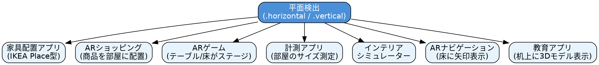

#### 実装の難易度と工数目安

| 機能 | 難易度 | 必要な追加実装 |
|------|:-----:|--------------|
| 単一オブジェクト配置 | ★☆☆ | タップ位置のRaycast |
| 複数オブジェクト管理 | ★★☆ | オブジェクト選択・削除UI |
| オブジェクト移動・回転 | ★★☆ | ジェスチャー認識 |
| 永続化（保存/復元） | ★★★ | WorldMap保存 |

---

### 10.2 画像トラッキングを使ったアプリ

印刷物やポスターをトリガーにARコンテンツを表示。

| アプリ名 | カテゴリ | 実装内容 | プラットフォーム |
|---------|---------|----------|----------------|
| **博物館ARガイド** | 教育 | 展示物の説明を画像認識で表示 | iOS |
| **ARメニュー** | 飲食 | メニュー写真から料理の3D表示 | iOS |
| **ARカード** | エンタメ | トレーディングカードが動く | iOS |
| **ARマニュアル** | 業務 | 製品画像から操作ガイド表示 | iOS/visionOS |
| **JigSpace** | 教育 | 製品を分解・組立表示 | visionOS |

#### 作れるもの

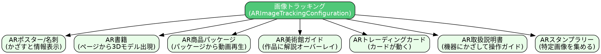

#### 実装のポイント

| 考慮事項 | 対策 |
|---------|------|
| 画像の特徴点が少ない | コントラストの高い画像を使用 |
| 複数画像の同時認識 | `maximumNumberOfTrackedImages`で制限 |
| 類似画像の誤認識 | 十分に異なる参照画像を用意 |
| 照明条件の変化 | 環境テクスチャリングで補正 |

---

### 10.3 顔トラッキングを使ったアプリ

TrueDepthカメラを使った顔の検出と表情認識。

| アプリ名 | カテゴリ | 実装内容 | プラットフォーム |
|---------|---------|----------|----------------|
| **Snapchat** | SNS | ARフィルター、Lenses | iOS |
| **Instagram** | SNS | 顔エフェクト | iOS |
| **TikTok** | 動画SNS | 顔変形、エフェクト | iOS |
| **Sephora Virtual Artist** | ビューティー | バーチャルメイク | iOS |
| **Warby Parker** | ファッション | メガネの試着 | iOS |
| **Zoom** | ビデオ会議 | バーチャル背景、フィルター | iOS |
| **Memoji** | コミュニケーション | 表情を反映したアバター | iOS（Apple純正） |

#### 作れるもの

```dot
digraph FaceTracking {
    rankdir=TB;
    node [shape=box, style="rounded,filled", fontname="Helvetica"];

    // Root
    face [label="顔トラッキング\n(ARFaceTrackingConfiguration)", fillcolor="#FF6B6B", fontcolor="white"];

    // Categories
    filter [label="ARフィルター/エフェクト\n(Snapchat型)", fillcolor="#FFE0E0"];
    tryon [label="バーチャル試着", fillcolor="#FFE0E0"];
    avatar [label="アバター/Vtuber", fillcolor="#FFE0E0"];
    entertainment [label="エンターテインメント", fillcolor="#FFE0E0"];
    health [label="ヘルスケア", fillcolor="#FFE0E0"];

    // Sub-items
    decoration [label="顔に装飾\n(メガネ、帽子、マスク)", fillcolor="#FFF5F5"];
    deform [label="顔変形\n(デフォルメ)", fillcolor="#FFF5F5"];
    bg_effect [label="背景エフェクト", fillcolor="#FFF5F5"];

    makeup [label="メイクアップ\n(リップ、アイシャドウ)", fillcolor="#FFF5F5"];
    glasses [label="メガネ/サングラス", fillcolor="#FFF5F5"];
    accessory [label="アクセサリー\n(ピアス、ネックレス)", fillcolor="#FFF5F5"];

    memoji [label="表情連動アバター\n(Memoji型)", fillcolor="#FFF5F5"];
    mocap [label="リアルタイム\nモーションキャプチャ", fillcolor="#FFF5F5"];

    faceswap [label="顔交換\n(Face Swap)", fillcolor="#FFF5F5"];
    aging [label="老化/若返り\nシミュレーション", fillcolor="#FFF5F5"];

    emotion [label="表情分析\n(感情認識)", fillcolor="#FFF5F5"];

    // Edges
    face -> {filter tryon avatar entertainment health};
    filter -> {decoration deform bg_effect};
    tryon -> {makeup glasses accessory};
    avatar -> {memoji mocap};
    entertainment -> {faceswap aging};
    health -> emotion;
}
```

#### 52ブレンドシェイプの活用例

| ブレンドシェイプ | 用途例 |
|----------------|-------|
| `eyeBlinkLeft/Right` | ウインク検出 |
| `mouthSmileLeft/Right` | 笑顔検出 |
| `jawOpen` | 口を開ける動作の検出 |
| `eyeLookUpLeft/Right` | 視線方向の推定 |
| `tongueOut` | 舌を出す動作の検出 |

---

### 10.4 ボディトラッキングを使ったアプリ

全身のポーズ・動きを検出。

| アプリ名 | カテゴリ | 実装内容 | プラットフォーム |
|---------|---------|----------|----------------|
| **フィットネスアプリ** | ヘルスケア | ポーズ判定、フォーム分析 | iOS |
| **ダンス練習アプリ** | エンタメ | 動きの採点 | iOS |
| **AR Dragon** | ゲーム | 体の動きでペット操作 | iOS |
| **Clips** | 動画 | ARシーン合成 | iOS（Apple純正） |
| **モーションキャプチャツール** | 制作 | 3Dアニメーション作成 | iOS |

#### 作れるもの

```dot
digraph BodyTracking {
    rankdir=TB;
    node [shape=box, style="rounded,filled", fontname="Helvetica"];

    // Root
    body [label="ボディトラッキング\n(ARBodyTrackingConfiguration)", fillcolor="#9B59B6", fontcolor="white"];

    // Categories
    fitness [label="フィットネス/\nエクササイズ", fillcolor="#E8D5F0"];
    dance [label="ダンス/\nパフォーマンス", fillcolor="#E8D5F0"];
    game [label="ゲーム", fillcolor="#E8D5F0"];
    fashion [label="ファッション", fillcolor="#E8D5F0"];
    sports [label="スポーツ分析", fillcolor="#E8D5F0"];

    // Sub-items
    yoga [label="ヨガポーズ判定", fillcolor="#F5EEF8"];
    workout [label="筋トレフォームチェック", fillcolor="#F5EEF8"];
    rehab [label="リハビリ支援", fillcolor="#F5EEF8"];

    dance_score [label="ダンス採点アプリ", fillcolor="#F5EEF8"];
    choreography [label="振り付け学習", fillcolor="#F5EEF8"];
    mocap [label="モーションキャプチャ", fillcolor="#F5EEF8"];

    body_game [label="体を使ったARゲーム", fillcolor="#F5EEF8"];
    avatar [label="バーチャルアバター操作", fillcolor="#F5EEF8"];
    gesture [label="ジェスチャーコマンド", fillcolor="#F5EEF8"];

    tryon [label="全身バーチャル試着", fillcolor="#F5EEF8"];

    golf [label="ゴルフスイング分析", fillcolor="#F5EEF8"];
    pitch [label="投球フォーム分析", fillcolor="#F5EEF8"];

    // Edges
    body -> {fitness dance game fashion sports};
    fitness -> {yoga workout rehab};
    dance -> {dance_score choreography mocap};
    game -> {body_game avatar gesture};
    fashion -> tryon;
    sports -> {golf pitch};
}
```

---

### 10.5 Scene Geometry / LiDARを使ったアプリ

環境の3Dメッシュ生成と高精度な深度情報。

| アプリ名 | カテゴリ | 実装内容 | プラットフォーム |
|---------|---------|----------|----------------|
| **Polycam** | 3Dスキャン | オブジェクト/空間の3Dスキャン | iOS (LiDAR) |
| **Canvas** | 建築 | 部屋の3Dモデル作成 | iOS (LiDAR) |
| **PLNAR** | 不動産 | 間取り図自動生成 | iOS (LiDAR) |
| **Matterport** | 不動産 | 空間のデジタルツイン | iOS (LiDAR) |
| **計測（Measure）** | ユーティリティ | 高精度な寸法測定 | iOS (LiDAR) |

#### 作れるもの

```dot
digraph SceneGeometry {
    rankdir=TB;
    node [shape=box, style="rounded,filled", fontname="Helvetica"];

    // Root
    lidar [label="Scene Geometry / LiDAR\n(ARMeshAnchor + sceneDepth)", fillcolor="#F39C12", fontcolor="white"];

    // Categories
    scan3d [label="3Dスキャン", fillcolor="#FEF3E2"];
    measure [label="計測・測量", fillcolor="#FEF3E2"];
    ar_composite [label="リアルなAR合成", fillcolor="#FEF3E2"];
    architecture [label="建築・不動産", fillcolor="#FEF3E2"];
    accessibility [label="アクセシビリティ", fillcolor="#FEF3E2"];

    // Sub-items
    obj_scan [label="オブジェクトスキャン\n(小物の3D化)", fillcolor="#FDF8F0"];
    space_scan [label="空間スキャン\n(部屋全体の3D化)", fillcolor="#FDF8F0"];
    person_scan [label="人物スキャン\n(3Dアバター作成)", fillcolor="#FDF8F0"];

    dimension [label="高精度な寸法測定", fillcolor="#FDF8F0"];
    area [label="部屋の面積/体積計算", fillcolor="#FDF8F0"];
    floorplan [label="間取り図自動生成", fillcolor="#FDF8F0"];

    occlusion [label="Object Occlusion\n(物体による遮蔽)", fillcolor="#FDF8F0"];
    physics [label="物理シミュレーション\n(現実の床/壁と衝突)", fillcolor="#FDF8F0"];
    shadow [label="環境への影の投影", fillcolor="#FDF8F0"];

    twin [label="物件のデジタルツイン", fillcolor="#FDF8F0"];
    reform [label="リフォーム\nシミュレーション", fillcolor="#FDF8F0"];
    compare [label="施工前/後の比較", fillcolor="#FDF8F0"];

    blind [label="視覚障害者向け\n空間認識支援", fillcolor="#FDF8F0"];

    // Edges
    lidar -> {scan3d measure ar_composite architecture accessibility};
    scan3d -> {obj_scan space_scan person_scan};
    measure -> {dimension area floorplan};
    ar_composite -> {occlusion physics shadow};
    architecture -> {twin reform compare};
    accessibility -> blind;
}
```

#### LiDAR vs 非LiDAR 比較

| 機能 | LiDARあり | LiDARなし |
|------|:--------:|:--------:|
| 平面検出速度 | 瞬時 | 数秒 |
| メッシュ生成 | ○ | × |
| Object Occlusion | ○ | × |
| 暗所での動作 | ○ | △ |
| 測定精度 | ±1cm | ±5cm |

---

### 10.6 People Occlusionを使ったアプリ

人物による自然な遮蔽処理。

| アプリ名 | カテゴリ | 実装内容 | プラットフォーム |
|---------|---------|----------|----------------|
| **Pokémon GO** | ゲーム | ポケモンが人の後ろに隠れる | iOS |
| **AR動画撮影アプリ** | エンタメ | 自然なAR合成 | iOS |
| **ARポートレート** | カメラ | 人物とARオブジェクトの自然な合成 | iOS |

#### 作れるもの

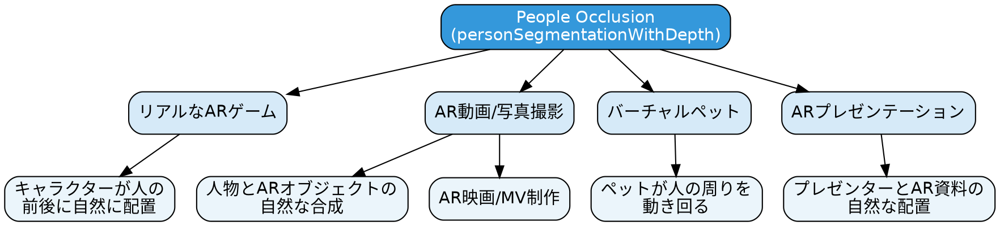

---

### 10.7 物理演算を使ったアプリ

RealityKitの物理シミュレーション。

| アプリ名 | カテゴリ | 実装内容 | プラットフォーム |
|---------|---------|----------|----------------|
| **Angry Birds AR** | ゲーム | 物理ベースのパズル | iOS |
| **ARボーリング** | ゲーム | 実空間でボーリング | iOS |
| **AR積み木** | 知育 | 物理シミュレーションで積み木遊び | iOS |
| **JengaAR** | ゲーム | ARジェンガ | iOS |

#### 作れるもの

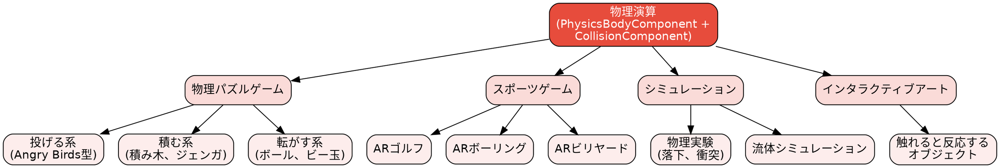

---

### 10.8 Spatial Audio / 3Dオーディオを使ったアプリ

空間に音を配置する3Dオーディオ。

| アプリ名 | カテゴリ | 実装内容 | プラットフォーム |
|---------|---------|----------|----------------|
| **djay** | 音楽制作 | 3Dターンテーブル環境 | visionOS |
| **Moog** | 楽器 | 空間シンセサイザー | visionOS |
| **ARオーディオガイド** | 教育 | 展示物から音声ガイド | iOS/visionOS |
| **AR音楽ゲーム** | ゲーム | 空間に配置された音符 | iOS |

#### 作れるもの

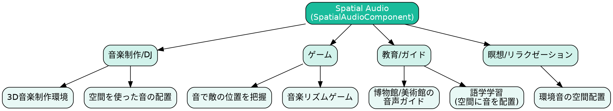

---

### 10.9 visionOS専用機能を使ったアプリ

Vision Pro固有の機能活用。

| アプリ名 | カテゴリ | 使用機能 | 特徴 |
|---------|---------|----------|------|
| **Encounter Dinosaurs** | デモ | Full Immersion | 恐竜が部屋に出現 |
| **JigSpace** | 教育 | Object Tracking, Hand Tracking | 3D製品の分解表示 |
| **djay** | 音楽 | Hand Tracking, Spatial Audio | 手でターンテーブル操作 |
| **Sky Guide** | 天文学 | Full Immersion | 360度プラネタリウム |
| **Fantastical** | 生産性 | Infinite Canvas | 空間にカレンダー配置 |
| **Microsoft 365** | 生産性 | Hand Gesture | ジェスチャーでExcel操作 |
| **HomeUI** | スマートホーム | Room Tracking | 実際の照明位置に制御UI |

#### visionOS専用機能で作れるもの

```dot
digraph visionOS {
    rankdir=TB;
    node [shape=box, style="rounded,filled", fontname="Helvetica"];

    // Root
    visionos [label="visionOS専用機能", fillcolor="#8E44AD", fontcolor="white"];

    // Categories
    hand [label="Hand Tracking", fillcolor="#E8DAEF"];
    room [label="Room Tracking", fillcolor="#E8DAEF"];
    object [label="Object Tracking\n(動的)", fillcolor="#E8DAEF"];
    portal [label="Portal", fillcolor="#E8DAEF"];
    canvas [label="Infinite Canvas", fillcolor="#E8DAEF"];

    // Hand Tracking sub-items
    gesture_ui [label="ハンドジェスチャーUI", fillcolor="#F5EEF8"];
    instrument [label="バーチャル楽器演奏", fillcolor="#F5EEF8"];
    modeling [label="3Dモデリング/彫刻", fillcolor="#F5EEF8"];
    sign_lang [label="手話認識", fillcolor="#F5EEF8"];

    // Room Tracking sub-items
    room_custom [label="部屋別カスタム体験", fillcolor="#F5EEF8"];
    smart_home [label="スマートホーム連携UI", fillcolor="#F5EEF8"];
    navigation [label="空間ナビゲーション", fillcolor="#F5EEF8"];

    // Object Tracking sub-items
    product_info [label="製品にかざして情報表示", fillcolor="#F5EEF8"];
    toy_game [label="おもちゃ連動ゲーム", fillcolor="#F5EEF8"];
    music_support [label="楽器演奏支援", fillcolor="#F5EEF8"];

    // Portal sub-items
    world_window [label="別世界への窓", fillcolor="#F5EEF8"];
    showroom [label="バーチャルショールーム", fillcolor="#F5EEF8"];
    video360 [label="360度動画表示", fillcolor="#F5EEF8"];

    // Infinite Canvas sub-items
    whiteboard [label="巨大ホワイトボード", fillcolor="#F5EEF8"];
    multiwindow [label="マルチウィンドウ作業環境", fillcolor="#F5EEF8"];
    dataviz [label="データビジュアライゼーション", fillcolor="#F5EEF8"];

    // Edges
    visionos -> {hand room object portal canvas};
    hand -> {gesture_ui instrument modeling sign_lang};
    room -> {room_custom smart_home navigation};
    object -> {product_info toy_game music_support};
    portal -> {world_window showroom video360};
    canvas -> {whiteboard multiwindow dataviz};
}
```

---

### 10.10 マルチユーザーAR / 永続化を使ったアプリ

複数デバイスでのAR共有、およびAR体験の保存・復元。

| アプリ名 | カテゴリ | 実装内容 | プラットフォーム |
|---------|---------|----------|----------------|
| **The Machines** | ゲーム | マルチプレイヤーARバトル | iOS |
| **Swift Playgrounds** | 教育 | 共有ARコーディング体験 | iOS |
| **Pokémon GO** | ゲーム | レイドバトル（複数人参加） | iOS |
| **IKEA Place** | 家具 | 配置を保存して後で確認 | iOS |
| **Spatial** | コラボレーション | リモートAR会議 | visionOS |
| **AR美術館/博物館** | 教育 | 場所固定のAR展示 | iOS |

#### 作れるもの

```dot
digraph MultiUserAR {
    rankdir=TB;
    node [shape=box, style="rounded,filled", fontname="Helvetica"];

    // Root
    multiuser [label="マルチユーザーAR / 永続化\n(ARWorldMap + Collaborative Session)", fillcolor="#2C3E50", fontcolor="white"];

    // Categories
    multiplayer [label="マルチプレイヤー\nゲーム", fillcolor="#5D6D7E"];
    collaboration [label="コラボレーション", fillcolor="#5D6D7E"];
    persistence [label="永続化AR", fillcolor="#5D6D7E"];
    location [label="ロケーションベースAR", fillcolor="#5D6D7E"];

    // Sub-items - Multiplayer
    battle [label="対戦ゲーム\n(同じ空間で)", fillcolor="#AEB6BF"];
    coop [label="協力ゲーム", fillcolor="#AEB6BF"];
    tabletop [label="テーブルトップゲーム", fillcolor="#AEB6BF"];

    // Sub-items - Collaboration
    meeting [label="AR会議\n(リモート参加)", fillcolor="#AEB6BF"];
    design [label="共同デザイン\nレビュー", fillcolor="#AEB6BF"];
    education [label="共有学習体験", fillcolor="#AEB6BF"];

    // Sub-items - Persistence
    save_restore [label="配置の保存/復元", fillcolor="#AEB6BF"];
    resume [label="中断した作業の再開", fillcolor="#AEB6BF"];
    share_config [label="設定の共有", fillcolor="#AEB6BF"];

    // Sub-items - Location
    museum [label="美術館/博物館ガイド", fillcolor="#AEB6BF"];
    retail [label="店舗AR体験", fillcolor="#AEB6BF"];
    tourism [label="観光ARガイド", fillcolor="#AEB6BF"];

    // Edges
    multiuser -> {multiplayer collaboration persistence location};
    multiplayer -> {battle coop tabletop};
    collaboration -> {meeting design education};
    persistence -> {save_restore resume share_config};
    location -> {museum retail tourism};
}
```

#### 実装パターン別の特徴

| パターン | 技術構成 | 難易度 | ユースケース |
|---------|---------|:------:|------------|
| **ローカルマルチプレイ** | MultipeerConnectivity + Collaborative Session | ★★☆ | 同室でのゲーム/学習 |
| **リモートマルチプレイ** | カスタムサーバー + WebSocket | ★★★ | オンライン対戦 |
| **SharePlay統合** | GroupActivity + RealityKit | ★★☆ | FaceTime中のAR共有 |
| **永続化（ローカル）** | ARWorldMap + ファイル保存 | ★★☆ | 作業の中断/再開 |
| **永続化（クラウド）** | ARWorldMap + CloudKit | ★★★ | 場所固定のAR体験 |

---

### 10.11 機能の組み合わせパターン

複数の機能を組み合わせることで、より高度なアプリが実現可能。

| 組み合わせ | 実現できること | アプリ例 |
|-----------|--------------|---------|
| 平面検出 + 物理演算 | 現実の床でボールが転がる | ARゲーム全般 |
| 顔トラッキング + ボディトラッキング | 全身アバター | Vtuberアプリ |
| 画像トラッキング + アニメーション | 動くポスター | ARマーケティング |
| LiDAR + People Occlusion | 完全なAR合成 | ARシネマ |
| Spatial Audio + 位置情報 | 場所連動オーディオ | ARオーディオツアー |
| Hand Tracking + 物理演算 | 手でオブジェクト操作 | visionOSゲーム |
| **Collaborative Session + MultipeerConnectivity** | 複数デバイスでAR共有 | マルチプレイヤーゲーム |
| **ARWorldMap + CloudKit** | 場所に固定されたAR体験 | 博物館ガイド |
| **SharePlay + RealityKit** | FaceTimeでAR共有 | リモートコラボレーション |

#### 複合アプリのアーキテクチャ例

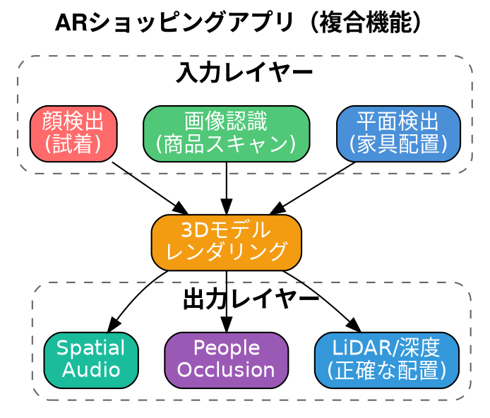

---

### 10.12 プラットフォーム別アプリ設計指針

#### iOS ARアプリ

| 観点 | 推奨事項 |
|------|---------|
| **セッション時間** | 短時間（1-5分）の体験を想定 |
| **UI** | 画面下部にコントロール配置 |
| **オンボーディング** | 平面検出の待機状態を明示 |
| **パフォーマンス** | バッテリー消費に注意 |
| **フォールバック** | ARKit非対応デバイス向け代替表示 |

#### visionOSアプリ

| 観点 | 推奨事項 |
|------|---------|
| **空間設計** | 1.5m以上のインタラクション距離 |
| **UI** | 視線+ピンチジェスチャー前提 |
| **没入度** | Shared Space → Full Spaceの段階設計 |
| **快適性** | 長時間利用に配慮（疲労軽減） |
| **アクセシビリティ** | 視線トラッキング代替入力 |

---

## 11. 参考リンク

### Apple公式ドキュメント

- [RealityKit Overview - Apple Developer](https://developer.apple.com/augmented-reality/realitykit/)
- [ARKit 6 - Apple Developer](https://developer.apple.com/augmented-reality/arkit/)
- [ARKit in visionOS - Apple Developer Documentation](https://developer.apple.com/documentation/arkit/arkit-in-visionos)
- [Materials, textures, and shaders - Apple Developer Documentation](https://developer.apple.com/documentation/realitykit/realitykit-materials-shaders)

### WWDCセッション

- [What's new in RealityKit - WWDC25](https://developer.apple.com/videos/play/wwdc2025/287/)
- [Create enhanced spatial computing experiences with ARKit - WWDC24](https://developer.apple.com/videos/play/wwdc2024/10100/)
- [Explore object tracking for visionOS - WWDC24](https://developer.apple.com/videos/play/wwdc2024/10101/)
- [Build spatial experiences with RealityKit - WWDC23](https://developer.apple.com/videos/play/wwdc2023/10080/)
- [Evolve your ARKit app for spatial experiences - WWDC23](https://developer.apple.com/videos/play/wwdc2023/10091/)

### コミュニティリソース

- [evolution-Metal-ARKit-RealityKit-sheet (GitHub)](https://github.com/ynagatomo/evolution-Metal-ARKit-RealityKit-sheet) - フレームワークの進化を追跡
- [RealityKit 911 — Entity Component System (Medium)](https://medium.com/macoclock/realitykit-911-entity-component-system-ecs-bfe0520e0e8e)
- [Step Into Vision - RealityKit Basics](https://stepinto.vision/example-code/realitykit-basics-entities-and-components/)

---

*最終更新: 2025年1月*
