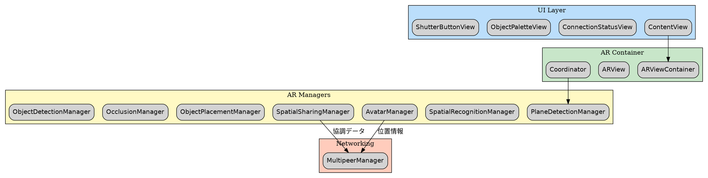

# Session Log - 02_SDK.md 作成

**日付**: 2026-01-19
**プロジェクト**: ydevARApp
**成果物**: `/docs/02_SDK.md`

---

## セッション概要

ydev勉強会向けに、ARKit + RealityKit + SceneKit の最新SDK機能を網羅したリファレンスドキュメントを作成。

---

## 作成したドキュメント構成

```
02_SDK.md (約2000行)
├── 1.  トラッキング・検出機能
├── 2.  シーン理解・深度
├── 3.  SceneKit（SCN）
├── 4.  RealityKit コンポーネント
├── 5.  マテリアル・シェーダー
├── 6.  アニメーション・パーティクル
├── 7.  特殊機能 (RealityKit 4 / WWDC25)
├── 8.  デバイス別機能マトリクス
├── 9.  実装パターン例
├── 10. フレームワーク機能別アプリ事例
│   ├── 10.1  平面検出を使ったアプリ
│   ├── 10.2  画像トラッキングを使ったアプリ
│   ├── 10.3  顔トラッキングを使ったアプリ
│   ├── 10.4  ボディトラッキングを使ったアプリ
│   ├── 10.5  Scene Geometry / LiDARを使ったアプリ
│   ├── 10.6  People Occlusionを使ったアプリ
│   ├── 10.7  物理演算を使ったアプリ
│   ├── 10.8  Spatial Audio / 3Dオーディオを使ったアプリ
│   ├── 10.9  visionOS専用機能を使ったアプリ
│   ├── 10.10 マルチユーザーAR / 永続化を使ったアプリ
│   ├── 10.11 機能の組み合わせパターン
│   └── 10.12 プラットフォーム別アプリ設計指針
└── 11. 参考リンク
```

---

## 主な作業内容

### 1. 初期ドキュメント作成
- ARKit / RealityKit の機能一覧を表形式で整理
- 実装ベースの具体的な選択肢を提示
- コード例を各セクションに追加

### 2. アプリ事例セクション追加
- iOS ARアプリ / visionOSアプリの具体例を追加
- フレームワーク機能別にアプリを分類
- 「何が作れるか」という観点で整理

### 3. Graphviz対応
- ASCII図をGraphviz（DOT言語）形式に変換
- 以下の図を作成:
  - ARKitトラッキング階層図
  - Scene Geometry処理フロー
  - RealityKit ECSアーキテクチャ
  - ARSession/RealityView選択フローチャート
  - SceneKit vs RealityKit選択フロー
  - マルチユーザーAR構成図
  - SharePlay統合図

### 4. マルチユーザーAR / 永続化セクション追加
- ARWorldMap（保存/復元）
- Collaborative Session
- MultipeerConnectivity
- SynchronizationComponent
- SharePlay統合
- 実装コード例

### 5. SceneKitセクション追加
- SceneKit vs RealityKit 比較表
- ARSCNView実装パターン
- SCNNode / SCNGeometry / SCNAction
- 物理演算（SCNPhysicsBody）
- パーティクル（SCNParticleSystem）
- マテリアル設定
- モデル読み込み
- ヒットテスト

### 6. セクション番号整理
- SceneKit追加に伴う全セクション番号の再付番
- サブセクション（10.1〜10.12）の番号修正

---

## 技術的なポイント

### カバーした主要機能

| カテゴリ | 機能 |
|---------|------|
| トラッキング | 平面/画像/顔/ボディ/ハンド/ルーム/オブジェクト |
| 深度・メッシュ | Scene Geometry, Depth API, LiDAR |
| レンダリング | SceneKit, RealityKit ECS, マテリアル |
| インタラクション | ジェスチャー, 物理演算, 当たり判定 |
| オーディオ | Spatial Audio, Ambient Audio |
| マルチユーザー | Collaborative Session, MultipeerConnectivity |
| 永続化 | ARWorldMap, CloudKit連携 |
| visionOS | Hand Tracking, Room Tracking, Portal |

### WWDC25新機能

- SpatialTrackingSession
- EnvironmentBlendingComponent
- MeshInstancesComponent
- ManipulationComponent
- Low-Level Mesh / Texture API

---

## 次のステップ候補

- [ ] 01_Overview.md（プロジェクト概要）の作成
- [ ] 03_Architecture.md（アーキテクチャ設計）の作成
- [ ] サンプルコードプロジェクトの作成
- [ ] Keynoteスライド用の図版エクスポート

---

## 備考

- ドキュメントはGraphviz図を含むため、レンダリングにはGraphviz対応ビューアが必要
- コード例はSwift 5.9+ / iOS 17+ / visionOS 1.0+ を想定

---

# Session Log - TestFlight配布 & Wiki作成 & Swift機能解説

**日付**: 2026-01-17 〜 2026-01-19
**プロジェクト**: ydevARApp
**成果物**: TestFlight配布、GitHub Wiki、技術ドキュメント

---

## セッション概要

ydevARAppのTestFlight配布準備、GitHubリポジトリ整備、Wiki作成、およびSwift/iOSの技術機能解説を実施。

---

## 1. TestFlight配布

### 1.1 App Store Connect設定

```
1. https://appstoreconnect.apple.com にログイン
2. 「マイApp」→「+」→「新規App」
3. 入力項目:
   - プラットフォーム: iOS
   - 名前: ydevARApp
   - プライマリ言語: 日本語
   - バンドルID: com.dsgarage.ydevARApp
   - SKU: ydevarapp2026
```

### 1.2 Bundle ID登録（Apple Developer）

```
1. https://developer.apple.com/account/resources/identifiers/list
2. 「+」→「App IDs」→「App」
3. 入力:
   - Description: ydevARApp
   - Bundle ID: Explicit → com.dsgarage.ydevARApp
4. Capabilities: Access WiFi Information にチェック
5. 「Continue」→「Register」
```

### 1.3 証明書作成（Xcode）

```swift
// Xcodeから自動作成（推奨）
1. Xcode → Settings (Cmd + ,)
2. 「Accounts」タブ
3. Apple IDを選択 →「Manage Certificates...」
4. 左下「+」→「Apple Distribution」
```

### 1.4 アーカイブ & アップロード

```
1. ビルドターゲット: 「Any iOS Device (arm64)」
2. Product → Archive
3. Organizer → Distribute App
4. App Store Connect → Upload
5. 署名確認 → Upload
```

### 1.5 TestFlight設定

```
1. App Store Connect → アプリ → TestFlight タブ
2. ビルド処理完了まで待機（5〜30分）
3. 輸出コンプライアンス:「暗号化を使用していない」→「いいえ」
4. 内部テスト → テスターを追加 → ビルドを配布
```

**TestFlightリンク**: https://testflight.apple.com/join/P8zMe1u3

---

## 2. GitHubリポジトリ整備

### 2.1 コミット内容

```bash
git add ydevARApp.xcodeproj/project.pbxproj \
        ydevARApp/Assets.xcassets/AppIcon.appiconset/ \
        ydevARApp/ContentView.swift \
        ydevARApp/AR/ \
        ydevARApp/Models/ \
        ydevARApp/Networking/ \
        ydevARApp/Views/ \
        Info.plist \
        docs/

git commit -m "Add AR collaboration features with plane detection, spatial sharing, and object placement"
git push origin main
```

### 2.2 追加されたファイル

| ディレクトリ | ファイル | 説明 |
|-------------|---------|------|
| `ydevARApp/AR/` | PlaneDetectionManager.swift | 平面検知 |
| | SpatialRecognitionManager.swift | 空間認識 |
| | SpatialSharingManager.swift | 空間共有 |
| | AvatarManager.swift | 参加者アバター |
| | ObjectPlacementManager.swift | オブジェクト配置 |
| | OcclusionManager.swift | オクルージョン |
| | ObjectDetectionManager.swift | オブジェクト検知 |
| `ydevARApp/Networking/` | MultipeerManager.swift | P2P通信 |
| `ydevARApp/Models/` | ParticipantInfo.swift | 参加者情報 |
| | SharedObject.swift | 共有オブジェクト |
| `ydevARApp/Views/` | ARViewContainer.swift | ARView統合 |
| | ConnectionStatusView.swift | 接続状態UI |
| | ObjectPaletteView.swift | オブジェクト選択 |
| | ShutterButtonView.swift | シャッターボタン |

### 2.3 README.md作成

```markdown
# ydevARApp

[yidev 第五十二回勉強会](https://yidev4.connpass.com/event/377507/) 用のARサンプルアプリ

## TestFlight
[TestFlightでインストール](https://testflight.apple.com/join/P8zMe1u3)

## 機能
- 平面検知（半透明プレート、自動最適化）
- 3Dオブジェクト配置（物理演算、投げ入れ）
- 空間共有（MultipeerConnectivity、Collaborative Session）
- オクルージョン（LiDAR、人物オクルージョン）
- 写真撮影（触覚フィードバック）
```

---

## 3. GitHub Wiki作成

### 3.1 Wiki構成

```
ydevARApp.wiki/
├── Home.md                      # トップページ + アーキテクチャ図
├── PlaneDetectionManager.md     # 平面検知
├── SpatialRecognitionManager.md # 空間認識
├── SpatialSharingManager.md     # 空間共有
├── AvatarManager.md             # アバター管理
├── ObjectPlacementManager.md    # オブジェクト配置
├── OcclusionManager.md          # オクルージョン
├── ObjectDetectionManager.md    # オブジェクト検知
├── MultipeerManager.md          # P2P通信
├── ARViewContainer.md           # ARView統合
├── Models.md                    # データモデル
└── images/
    ├── architecture.dot         # Graphvizソース
    └── architecture.png         # 生成画像
```

### 3.2 アーキテクチャ図（Graphviz）



**Wiki URL**: https://github.com/dsgarage/ydevARApp/wiki

---

## 4. Swift/iOS 技術解説

### 4.1 Core Data マイグレーション

#### 軽量マイグレーション設定

```swift
let container = NSPersistentContainer(name: "MyApp")
let description = container.persistentStoreDescriptions.first
description?.setOption(true as NSNumber,
    forKey: NSMigratePersistentStoresAutomaticallyOption)
description?.setOption(true as NSNumber,
    forKey: NSInferMappingModelAutomaticallyOption)
```

#### SwiftData マイグレーション（iOS 17+）

```swift
import SwiftData

enum SchemaV1: VersionedSchema {
    static var versionIdentifier = Schema.Version(1, 0, 0)
    static var models: [any PersistentModel.Type] { [Item.self] }

    @Model class Item {
        var name: String
        var timestamp: Date
    }
}

enum SchemaV2: VersionedSchema {
    static var versionIdentifier = Schema.Version(2, 0, 0)
    static var models: [any PersistentModel.Type] { [Item.self] }

    @Model class Item {
        var name: String
        var title: String  // 新規追加
        var timestamp: Date
    }
}

enum MyMigrationPlan: SchemaMigrationPlan {
    static var schemas: [any VersionedSchema.Type] {
        [SchemaV1.self, SchemaV2.self]
    }

    static var stages: [MigrationStage] {
        [MigrationStage.lightweight(fromVersion: SchemaV1.self, toVersion: SchemaV2.self)]
    }
}
```

### 4.2 Automatic Grammar Agreement（iOS 15+）

#### 基本構文

```swift
// 数の一致
let count = 3
Text("^[\(count) item](inflect: true)")
// 1 → "1 item", 3 → "3 items"

// 性別の一致（スペイン語など）
var morphology = Morphology()
morphology.grammaticalGender = .feminine
```

#### agreeWithArgument（iOS 17+）

```swift
// 複数単語を同じ引数に一致させる
"^[This](agreeWithArgument: 1) ^[\(count) item](inflect: true) ^[is](agreeWithArgument: 1) ready"
// count=1 → "This 1 item is ready"
// count=3 → "These 3 items are ready"

// スペイン語での性別一致
"^[El](agreeWithArgument: 1) ^[usuario](agreeWithArgument: 1) está ^[contento](agreeWithArgument: 1)"
// 男性 → "El usuario está contento"
// 女性 → "La usuaria está contenta"
```

#### 従来のスペイン語対応（agreeWithArgument以前）

```swift
// 方法1: 性別ごとに別文字列
"welcome_male" = "Bienvenido"
"welcome_female" = "Bienvenida"

// 方法2: stringsdict
// NSStringPluralRuleType を流用

// 方法3: プレースホルダー
"user_is_happy" = "%@ usuari%@ está content%@"
String(format: format, "El", "o", "o")  // 男性
String(format: format, "La", "a", "a")  // 女性

// 方法4: 性別中立表現
"welcome_user" = "Te damos la bienvenida"
```

### 4.3 Markdown Parser（iOS 15+）

#### AttributedString でパース

```swift
import Foundation

let markdown = "**太字** と *イタリック* と `コード`"
let attributed = try! AttributedString(markdown: markdown)

// SwiftUIで表示
Text(attributed)
```

#### パースオプション

```swift
let options = AttributedString.MarkdownParsingOptions(
    allowsExtendedAttributes: true,
    interpretedSyntax: .inlineOnlyPreservingWhitespace
)
```

#### SwiftUIでの使用

```swift
Text("**Welcome** to *SwiftUI*!")
Text("[Apple](https://apple.com) のサイト")
```

### 4.4 Markdown Extended Attributes（iOS 15+）

#### 構文

```markdown
^[テキスト](key: 'value')
^[テキスト](key1: 'v1', key2: 'v2')
```

#### カスタム属性の定義

```swift
// 属性キー定義
enum PriorityAttribute: CodableAttributedStringKey,
                        MarkdownDecodableAttributedStringKey {
    typealias Value = String
    static let name = "priority"
}

// AttributeScope 拡張
extension AttributeScopes {
    struct MyAppAttributes: AttributeScope {
        let priority: PriorityAttribute
        let swiftUI: SwiftUIAttributes
    }
    var myApp: MyAppAttributes.Type { MyAppAttributes.self }
}

// 使用
let markdown = "^[警告](priority: 'high')"
let options = AttributedString.MarkdownParsingOptions(
    allowsExtendedAttributes: true
)
let attributed = try! AttributedString(
    markdown: markdown,
    including: AttributeScopes.MyAppAttributes.self,
    options: options
)

// 属性読み取り
for run in attributed.runs {
    if let priority = run.priority {
        print("Priority: \(priority)")
    }
}
```

---

## 5. 成果物まとめ

| 成果物 | URL/パス |
|--------|----------|
| TestFlight | https://testflight.apple.com/join/P8zMe1u3 |
| GitHub | https://github.com/dsgarage/ydevARApp |
| Wiki | https://github.com/dsgarage/ydevARApp/wiki |
| 勉強会 | https://yidev4.connpass.com/event/377507/ |

---

## 6. 備考

- macOS 26ではキーチェーンアクセスが「パスワード」アプリに統合
  - `open -a "Keychain Access"` で従来のアプリを起動可能
- Vision Pro警告（UIRequiredDeviceCapabilities: arkit）は無視してOK
- 輸出コンプライアンス: HTTPSのみなら「暗号化なし」でOK
